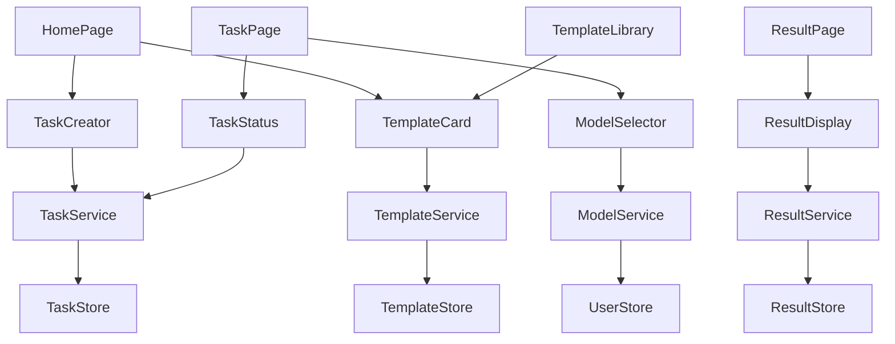
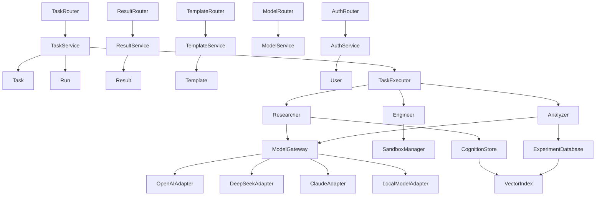

# R U Socrates 模块分解文档

## 1. 项目结构

```
R U Socrates/
├── apps/
│   ├── web/           # Next.js 前端应用
│   └── desktop/       # Tauri 桌面应用
├── services/
│   ├── api/           # FastAPI 后端服务
│   ├── worker/        # 任务执行 Worker
│   ├── model-gateway/ # 模型网关服务
│   └── memory/        # 记忆系统服务
├── packages/
│   ├── types/         # 共享类型定义
│   ├── utils/         # 共享工具函数
│   └── adapters/      # 适配器库
├── infra/             # 基础设施配置
├── planning/          # 项目规划文档
└── README.md          # 项目说明
```

## 2. 核心模块详细分解

### 2.1 前端模块 (apps/web)

#### 2.1.1 页面组件

| 模块 | 职责 | 文件位置 | 技术栈 |
|------|------|----------|--------|
| HomePage | 首页，展示模板和快速开始 | apps/web/app/page.tsx | Next.js, React |
| TaskPage | 任务配置和运行控制 | apps/web/app/tasks/[id]/page.tsx | Next.js, React |
| ResultPage | 结果展示和解释 | apps/web/app/results/[id]/page.tsx | Next.js, React |
| TemplateLibrary | 模板管理和预览 | apps/web/app/templates/page.tsx | Next.js, React |
| SettingsPage | 系统设置 | apps/web/app/settings/page.tsx | Next.js, React |

#### 2.1.2 功能组件

| 模块 | 职责 | 文件位置 | 技术栈 |
|------|------|----------|--------|
| TaskCreator | 任务创建表单 | apps/web/components/TaskCreator.tsx | React, Shadcn/UI |
| TaskStatus | 任务状态和进度显示 | apps/web/components/TaskStatus.tsx | React, Shadcn/UI |
| ResultDisplay | 结果展示组件 | apps/web/components/ResultDisplay.tsx | React, Shadcn/UI |
| TemplateCard | 模板卡片组件 | apps/web/components/TemplateCard.tsx | React, Shadcn/UI |
| ModelSelector | 模型选择器 | apps/web/components/ModelSelector.tsx | React, Shadcn/UI |

#### 2.1.3 状态管理

| 模块 | 职责 | 文件位置 | 技术栈 |
|------|------|----------|--------|
| TaskStore | 任务状态管理 | apps/web/stores/taskStore.ts | Zustand |
| ResultStore | 结果状态管理 | apps/web/stores/resultStore.ts | Zustand |
| TemplateStore | 模板状态管理 | apps/web/stores/templateStore.ts | Zustand |
| UserStore | 用户状态管理 | apps/web/stores/userStore.ts | Zustand |

#### 2.1.4 服务

| 模块 | 职责 | 文件位置 | 技术栈 |
|------|------|----------|--------|
| TaskService | 任务相关 API 调用 | apps/web/services/taskService.ts | TypeScript, TanStack Query |
| ResultService | 结果相关 API 调用 | apps/web/services/resultService.ts | TypeScript, TanStack Query |
| TemplateService | 模板相关 API 调用 | apps/web/services/templateService.ts | TypeScript, TanStack Query |
| ModelService | 模型相关 API 调用 | apps/web/services/modelService.ts | TypeScript, TanStack Query |

### 2.2 后端 API 模块 (services/api)

#### 2.2.1 路由

| 模块 | 职责 | 文件位置 | 技术栈 |
|------|------|----------|--------|
| TaskRouter | 任务相关路由 | services/api/routes/task.py | FastAPI |
| ResultRouter | 结果相关路由 | services/api/routes/result.py | FastAPI |
| TemplateRouter | 模板相关路由 | services/api/routes/template.py | FastAPI |
| ModelRouter | 模型相关路由 | services/api/routes/model.py | FastAPI |
| AuthRouter | 认证相关路由 | services/api/routes/auth.py | FastAPI |

#### 2.2.2 服务

| 模块 | 职责 | 文件位置 | 技术栈 |
|------|------|----------|--------|
| TaskService | 任务业务逻辑 | services/api/services/task_service.py | Python |
| ResultService | 结果业务逻辑 | services/api/services/result_service.py | Python |
| TemplateService | 模板业务逻辑 | services/api/services/template_service.py | Python |
| ModelService | 模型业务逻辑 | services/api/services/model_service.py | Python |
| AuthService | 认证业务逻辑 | services/api/services/auth_service.py | Python |

#### 2.2.3 数据模型

| 模块 | 职责 | 文件位置 | 技术栈 |
|------|------|----------|--------|
| Task | 任务数据模型 | services/api/models/task.py | SQLAlchemy |
| Run | 任务执行实例模型 | services/api/models/run.py | SQLAlchemy |
| Result | 执行结果模型 | services/api/models/result.py | SQLAlchemy |
| Template | 模板数据模型 | services/api/models/template.py | SQLAlchemy |
| User | 用户数据模型 | services/api/models/user.py | SQLAlchemy |

### 2.3  Worker 模块 (services/worker)

#### 2.3.1 核心组件

| 模块 | 职责 | 文件位置 | 技术栈 |
|------|------|----------|--------|
| TaskExecutor | 任务执行器 | services/worker/executor.py | Python |
| SandboxManager | 沙箱管理器 | services/worker/sandbox.py | Python, Docker |
| ResultProcessor | 结果处理器 | services/worker/processor.py | Python |
| RetryManager | 重试管理器 | services/worker/retry.py | Python |

#### 2.3.2 研究循环

| 模块 | 职责 | 文件位置 | 技术栈 |
|------|------|----------|--------|
| Researcher | 代码生成 | services/worker/researcher.py | Python, LLM |
| Engineer | 代码执行 | services/worker/engineer.py | Python, Docker |
| Analyzer | 结果分析 | services/worker/analyzer.py | Python, LLM |

### 2.4 模型网关模块 (services/model-gateway)

#### 2.4.1 核心组件

| 模块 | 职责 | 文件位置 | 技术栈 |
|------|------|----------|--------|
| ModelGateway | 模型网关核心 | services/model-gateway/gateway.py | Python |
| ModelRegistry | 模型注册表 | services/model-gateway/registry.py | Python |
| CostManager | 成本管理器 | services/model-gateway/cost.py | Python |
| RateLimiter | 速率限制器 | services/model-gateway/rate.py | Python |

#### 2.4.2 模型适配器

| 模块 | 职责 | 文件位置 | 技术栈 |
|------|------|----------|--------|
| OpenAIAdapter | OpenAI 模型适配器 | services/model-gateway/adapters/openai.py | Python, OpenAI SDK |
| DeepSeekAdapter | DeepSeek 模型适配器 | services/model-gateway/adapters/deepseek.py | Python, HTTP |
| ClaudeAdapter | Claude 模型适配器 | services/model-gateway/adapters/claude.py | Python, Anthropic SDK |
| LocalModelAdapter | 本地模型适配器 | services/model-gateway/adapters/local.py | Python, HTTP |

### 2.5 记忆系统模块 (services/memory)

#### 2.5.1 核心组件

| 模块 | 职责 | 文件位置 | 技术栈 |
|------|------|----------|--------|
| CognitionStore | 领域知识存储 | services/memory/cognition.py | Python, FAISS |
| ExperimentDatabase | 实验结果存储 | services/memory/database.py | Python, FAISS |
| VectorIndex | 向量索引 | services/memory/vector.py | Python, FAISS |
| KnowledgeDistiller | 知识蒸馏器 | services/memory/distiller.py | Python |

### 2.6 共享类型模块 (packages/types)

| 模块 | 职责 | 文件位置 | 技术栈 |
|------|------|----------|--------|
| TaskTypes | 任务相关类型 | packages/types/task.ts | TypeScript |
| ResultTypes | 结果相关类型 | packages/types/result.ts | TypeScript |
| ModelTypes | 模型相关类型 | packages/types/model.ts | TypeScript |
| TemplateTypes | 模板相关类型 | packages/types/template.ts | TypeScript |
| UserTypes | 用户相关类型 | packages/types/user.ts | TypeScript |

### 2.7 共享工具模块 (packages/utils)

| 模块 | 职责 | 文件位置 | 技术栈 |
|------|------|----------|--------|
| Logger | 日志工具 | packages/utils/logger.ts | TypeScript |
| ErrorHandler | 错误处理工具 | packages/utils/error.ts | TypeScript |
| Validator | 数据验证工具 | packages/utils/validator.ts | TypeScript |
| Storage | 存储工具 | packages/utils/storage.ts | TypeScript |

### 2.8 适配器模块 (packages/adapters)

| 模块 | 职责 | 文件位置 | 技术栈 |
|------|------|----------|--------|
| ASIAdapter | ASI-Evolve 适配器 | packages/adapters/asi.ts | TypeScript |
| ASIArchAdapter | ASI-Arch 适配器 | packages/adapters/asi-arch.ts | TypeScript |
| LLMAdapter | LLM 适配器 | packages/adapters/llm.ts | TypeScript |
| StorageAdapter | 存储适配器 | packages/adapters/storage.ts | TypeScript |

## 3. 模块依赖关系

### 3.1 前端依赖关系



### 3.2 后端依赖关系



## 4. 关键模块详细说明

### 4.1 任务执行器 (TaskExecutor)

**职责**：
- 从队列获取任务
- 准备执行环境
- 调用研究循环
- 处理结果
- 更新任务状态

**核心流程**：
1. 从 Redis 队列获取任务
2. 加载任务配置和输入数据
3. 初始化记忆系统和模型网关
4. 执行研究循环：
   - 采样历史节点
   - 检索相关认知项目
   - 生成候选代码
   - 执行代码
   - 分析结果
   - 保存节点
5. 处理最终结果
6. 更新任务状态
7. 通知 API 服务

### 4.2 研究循环 (Research Loop)

**职责**：
- 实现 "知识 → 假设 → 实验 → 分析" 的闭环
- 生成和评估候选代码
- 优化实验结果

**核心流程**：
1. **Researcher**：
   - 从记忆系统获取灵感
   - 生成候选代码
   - 提供修改动机

2. **Engineer**：
   - 在沙箱中执行代码
   - 运行评测脚本
   - 收集执行结果

3. **Analyzer**：
   - 分析实验结果
   - 与历史最佳比较
   - 生成自然语言分析

### 4.3 模型网关 (ModelGateway)

**职责**：
- 统一模型接口
- 管理模型调用
- 处理错误和重试
- 监控成本和使用情况

**核心功能**：
- 模型注册和管理
- 统一的推理接口
- 负载均衡和故障转移
- 成本监控和预算管理
- 速率限制和重试机制

### 4.4 记忆系统 (Memory System)

**职责**：
- 存储和管理领域知识
- 存储和管理实验结果
- 提供向量检索能力
- 支持知识蒸馏

**核心组件**：
- **Cognition Store**：存储领域知识、论文和启发式规则
- **Experiment Database**：存储实验节点和结果
- **Vector Index**：提供高效的向量检索
- **Knowledge Distiller**：从实验结果中提取知识

### 4.5 沙箱执行器 (Sandbox Manager)

**职责**：
- 隔离执行用户代码
- 限制资源使用
- 控制执行时间
- 确保安全执行

**核心功能**：
- 容器化执行环境
- 资源限制（CPU、内存、网络）
- 超时控制
- 安全防护
- 结果收集

## 5. 模块实现顺序

### 5.1 第一阶段：基础设施

1. **共享类型**：定义核心数据结构
2. **记忆系统**：实现基本存储和检索
3. **模型网关**：实现模型接口和适配器
4. **沙箱执行器**：实现安全执行环境

### 5.2 第二阶段：核心功能

1. **研究循环**：实现 Researcher、Engineer、Analyzer
2. **TaskExecutor**：实现任务执行和管理
3. **API 服务**：实现 RESTful 接口
4. **Worker 服务**：实现任务队列和执行

### 5.3 第三阶段：前端和集成

1. **前端页面**：实现基本页面和组件
2. **状态管理**：实现前端状态管理
3. **服务集成**：集成前端和后端
4. **测试和优化**：测试系统功能和性能

## 6. 技术债务管理

### 6.1 潜在技术债务

1. **模型依赖**：依赖外部模型 API 可能导致成本和可用性问题
2. **性能瓶颈**：复杂任务的执行时间可能较长
3. **安全风险**：沙箱执行用户代码存在安全风险
4. **存储开销**：记忆系统可能占用大量存储空间
5. **可扩展性**：系统架构可能难以应对大规模部署

### 6.2 缓解策略

1. **模型依赖**：
   - 实现模型降级策略
   - 支持本地模型作为备选
   - 建立模型调用监控和预算管理

2. **性能瓶颈**：
   - 实现任务并行处理
   - 优化代码执行和模型调用
   - 提供任务优先级和队列管理

3. **安全风险**：
   - 加强沙箱隔离
   - 实现输入验证和代码分析
   - 定期安全审计

4. **存储开销**：
   - 实现数据压缩和清理策略
   - 提供存储配置选项
   - 支持外部存储后端

5. **可扩展性**：
   - 采用微服务架构
   - 实现水平扩展
   - 支持容器化部署

## 7. 结论

R U Socrates 项目的模块分解清晰地定义了系统的各个组件和它们之间的关系。通过合理的模块划分和依赖管理，系统能够实现高内聚、低耦合的设计，提高可维护性和可扩展性。

关键模块如任务执行器、研究循环、模型网关和记忆系统构成了系统的核心功能，而前端和 API 层则提供了用户界面和服务接口。通过分阶段的实现顺序，项目可以逐步构建和测试各个组件，确保系统的稳定性和可靠性。

同时，通过识别和管理潜在的技术债务，项目可以在发展过程中保持健康的技术状态，为未来的扩展和优化做好准备。