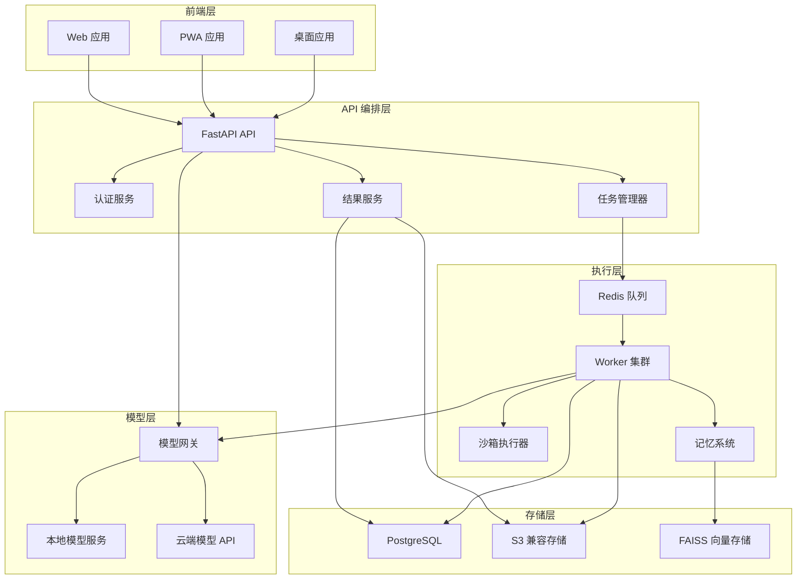

# R U Socrates 技术架构文档

## 1. 系统架构概述

R U Socrates 采用分层架构设计，将系统分为前端、API 编排层、执行层和模型层四个主要部分。这种设计允许系统各组件解耦，提高可维护性和可扩展性。



## 2. 核心组件详细设计

### 2.1 前端层

#### 2.1.1 Web 应用
- **技术栈**：Next.js (App Router)、React Server Components、TypeScript
- **核心功能**：
  - 任务创建和配置
  - 模板选择和管理
  - 运行状态监控
  - 结果展示和解释
  - 报告导出和分享
- **页面结构**：
  - 首页：任务模板和快速开始
  - 工作台：任务配置和运行控制
  - 结果页：结果展示和解释
  - 模板库：模板管理和预览

#### 2.1.2 PWA 应用
- **技术栈**：Next.js PWA、Service Worker
- **核心功能**：
  - 离线访问基础功能
  - 安装到桌面
  - 推送通知
- **优势**：提供接近原生应用的体验，支持离线操作

#### 2.1.3 桌面应用
- **技术栈**：Tauri
- **核心功能**：
  - 本地优先模式
  - 系统集成
  - 高级配置
- **优势**：提供更强大的本地计算能力和系统集成

### 2.2 API 编排层

#### 2.2.1 FastAPI API
- **技术栈**：FastAPI、Python 3.10+
- **核心功能**：
  - RESTful 接口
  - 数据验证
  - OpenAPI 文档
  - 错误处理
- **端点设计**：
  - `/api/tasks`：任务管理
  - `/api/results`：结果查询
  - `/api/templates`：模板管理
  - `/api/models`：模型配置

#### 2.2.2 认证服务
- **技术栈**：JWT、OAuth2
- **核心功能**：
  - 用户认证
  - 授权管理
  - 会话管理
- **安全措施**：
  - 密码哈希
  - 令牌过期
  - 权限控制

#### 2.2.3 任务管理器
- **核心功能**：
  - 任务创建和调度
  - 状态管理
  - 重试机制
  - 取消操作
- **数据模型**：
  - Task：任务基本信息
  - Run：任务执行实例
  - Result：执行结果

#### 2.2.4 结果服务
- **核心功能**：
  - 结果存储和查询
  - 报告生成
  - 导出功能
- **支持格式**：
  - Markdown
  - PDF
  - JSON

### 2.3 执行层

#### 2.3.1 Redis 队列
- **技术栈**：Redis、Celery/RQ
- **核心功能**：
  - 任务队列管理
  - 优先级调度
  - 任务重试
  - 死信处理

#### 2.3.2 Worker 集群
- **技术栈**：Python、AsyncIO
- **核心功能**：
  - 任务执行
  - 资源管理
  - 错误处理
  - 日志记录
- **工作流程**：
  1. 从队列获取任务
  2. 准备执行环境
  3. 调用相应服务
  4. 处理结果
  5. 更新任务状态

#### 2.3.3 沙箱执行器
- **技术栈**：Docker、gVisor
- **核心功能**：
  - 代码隔离执行
  - 资源限制
  - 超时控制
  - 安全防护
- **安全措施**：
  - 网络隔离
  - 文件系统限制
  - 进程限制

#### 2.3.4 记忆系统
- **技术栈**：FAISS、sentence-transformers
- **核心组件**：
  - Cognition Store：领域知识存储
  - Experiment Database：实验结果存储
- **功能**：
  - 向量检索
  - 相似度匹配
  - 历史记录管理
  - 知识蒸馏

### 2.4 模型层

#### 2.4.1 模型网关
- **核心功能**：
  - 模型统一接口
  - 负载均衡
  - 故障转移
  - 成本监控
- **支持模型**：
  - OpenAI (GPT-4o, etc.)
  - DeepSeek
  - Claude
  - Gemini
  - 本地模型 (Ollama)

#### 2.4.2 本地模型服务
- **技术栈**：Ollama、vLLM
- **核心功能**：
  - 本地模型管理
  - 推理服务
  - 资源监控
- **优势**：
  - 隐私保护
  - 无网络依赖
  - 成本控制

#### 2.4.3 云端模型 API
- **核心功能**：
  - API 调用管理
  - 速率限制
  - 错误处理
- **优势**：
  - 无需本地硬件
  - 支持最新模型
  - 可扩展性

### 2.5 存储层

#### 2.5.1 PostgreSQL
- **核心功能**：
  - 关系数据存储
  - 事务支持
  - 复杂查询
- **数据模型**：
  - Users
  - Tasks
  - Runs
  - Templates
  - Results

#### 2.5.2 S3 兼容存储
- **核心功能**：
  - 对象存储
  - 版本控制
  - 访问控制
- **存储内容**：
  - 结果文件
  - 导出报告
  - 评测数据
  - 日志文件

#### 2.5.3 FAISS 向量存储
- **核心功能**：
  - 向量索引
  - 相似度搜索
  - 高效检索
- **存储内容**：
  - 领域知识嵌入
  - 实验结果嵌入
  - 代码嵌入

## 3. 数据流设计

### 3.1 任务创建流程

1. 用户在前端创建任务，选择模板和配置参数
2. 前端调用 API 编排层的 `/api/tasks` 端点
3. API 编排层验证输入并创建任务记录
4. 任务管理器将任务加入 Redis 队列
5. Worker 从队列获取任务并开始执行

### 3.2 任务执行流程

1. Worker 从队列获取任务
2. 准备执行环境，包括：
   - 加载任务配置
   - 初始化记忆系统
   - 连接模型网关
3. 执行研究循环：
   - 采样历史节点
   - 检索相关认知项目
   - 生成候选代码
   - 在沙箱中执行代码
   - 分析结果
   - 保存节点到数据库
4. 处理结果并更新任务状态
5. 将结果写入存储层

### 3.3 结果查询流程

1. 用户在前端请求任务结果
2. 前端调用 API 编排层的 `/api/results` 端点
3. API 编排层从存储层获取结果
4. 结果服务处理结果数据，生成可展示的格式
5. API 编排层返回结果给前端
6. 前端展示结果和解释

## 4. 关键接口设计

### 4.1 任务接口

#### 创建任务
- **路径**：`POST /api/tasks`
- **请求体**：
  ```json
  {
    "name": "任务名称",
    "template_id": "模板 ID",
    "config": {
      "model": "模型名称",
      "parameters": {}
    },
    "input_data": "输入数据"
  }
  ```
- **响应**：
  ```json
  {
    "id": "任务 ID",
    "status": "created",
    "created_at": "创建时间"
  }
  ```

#### 获取任务状态
- **路径**：`GET /api/tasks/{task_id}`
- **响应**：
  ```json
  {
    "id": "任务 ID",
    "name": "任务名称",
    "status": "running",
    "progress": 50,
    "created_at": "创建时间",
    "updated_at": "更新时间"
  }
  ```

### 4.2 结果接口

#### 获取任务结果
- **路径**：`GET /api/results/{task_id}`
- **响应**：
  ```json
  {
    "task_id": "任务 ID",
    "status": "completed",
    "score": 0.95,
    "analysis": "分析结果",
    "evidence": ["证据 1", "证据 2"],
    "code": "生成的代码",
    "metrics": {}
  }
  ```

#### 导出结果
- **路径**：`GET /api/results/{task_id}/export`
- **查询参数**：`format` (markdown, pdf, json)
- **响应**：文件下载

### 4.3 模板接口

#### 获取模板列表
- **路径**：`GET /api/templates`
- **响应**：
  ```json
  [
    {
      "id": "模板 ID",
      "name": "模板名称",
      "description": "模板描述",
      "category": "模板类别"
    }
  ]
  ```

#### 获取模板详情
- **路径**：`GET /api/templates/{template_id}`
- **响应**：
  ```json
  {
    "id": "模板 ID",
    "name": "模板名称",
    "description": "模板描述",
    "category": "模板类别",
    "parameters": [],
    "prompt": "模板提示"
  }
  ```

## 5. 部署设计

### 5.1 本地开发环境

- **技术栈**：Docker Compose
- **组件**：
  - Next.js 前端
  - FastAPI 后端
  - PostgreSQL
  - Redis
  - 本地模型服务 (可选)

### 5.2 测试环境

- **技术栈**：Docker Compose + CI/CD
- **组件**：
  - 与开发环境相同，但配置不同
  - 集成测试工具
  - 监控系统

### 5.3 生产环境

- **技术栈**：Kubernetes
- **组件**：
  - 容器化的前端和后端服务
  - 数据库集群
  - 队列系统
  - 负载均衡
  - 监控和日志系统

### 5.4 扩展策略

- **水平扩展**：通过增加 Worker 节点提高处理能力
- **垂直扩展**：为模型服务提供更强大的硬件
- **自动扩展**：根据负载自动调整资源

## 6. 安全设计

### 6.1 认证与授权

- **JWT 令牌**：用于用户认证
- **角色基础访问控制**：限制用户权限
- **API 密钥管理**：安全存储和使用 API 密钥

### 6.2 数据安全

- **数据加密**：传输和存储加密
- **数据脱敏**：敏感数据处理
- **访问控制**：细粒度的资源访问控制

### 6.3 代码安全

- **沙箱执行**：隔离执行用户代码
- **输入验证**：防止注入攻击
- **依赖检查**：定期检查依赖漏洞

### 6.4 网络安全

- **HTTPS**：加密传输
- **CORS**：跨域资源共享配置
- **防火墙**：网络访问控制

## 7. 监控与日志

### 7.1 监控系统

- **技术栈**：Prometheus + Grafana
- **监控指标**：
  - API 响应时间
  - Worker 利用率
  - 模型调用频率和成本
  - 任务执行时间

### 7.2 日志系统

- **技术栈**：ELK Stack
- **日志类型**：
  - API 访问日志
  - Worker 执行日志
  - 模型调用日志
  - 错误日志

### 7.3 告警系统

- **技术栈**：Alertmanager
- **告警类型**：
  - 系统故障
  - 性能异常
  - 安全事件
  - 成本异常

## 8. 性能优化

### 8.1 前端优化

- **代码分割**：减少初始加载时间
- **缓存策略**：静态资源缓存
- **SSR**：服务端渲染
- **Web Workers**：后台处理

### 8.2 后端优化

- **异步处理**：非阻塞 I/O
- **缓存**：频繁访问数据缓存
- **数据库优化**：索引和查询优化
- **连接池**：数据库连接管理

### 8.3 模型优化

- **批量请求**：合并模型调用
- **缓存**：模型响应缓存
- **模型选择**：根据任务选择合适模型
- **超时控制**：防止长时间运行

### 8.4 存储优化

- **压缩**：减少存储空间
- **分区**：数据分区管理
- **清理策略**：定期清理过期数据

## 9. 扩展性设计

### 9.1 插件系统

- **模板插件**：自定义模板
- **评测插件**：自定义评测逻辑
- **模型插件**：支持新模型
- **存储插件**：支持新存储后端

### 9.2 API 扩展性

- **RESTful 设计**：标准接口
- **OpenAPI 文档**：自动生成文档
- **版本控制**：API 版本管理

### 9.3 多租户支持

- **隔离存储**：租户数据隔离
- **资源限制**：租户资源控制
- **定制配置**：租户特定配置

## 10. 结论

R U Socrates 采用分层架构设计，将系统分为前端、API 编排层、执行层和模型层四个主要部分。这种设计使得系统各组件解耦，提高了可维护性和可扩展性。通过合理的数据流设计、关键接口设计和部署设计，系统能够高效地处理任务执行和结果管理。同时，安全设计、监控与日志、性能优化和扩展性设计确保了系统的可靠性、安全性和可扩展性。

该架构设计为 R U Socrates 项目提供了坚实的技术基础，使得项目能够从 ASI-Evolve 研究框架顺利转变为面向普通用户的端到端产品。