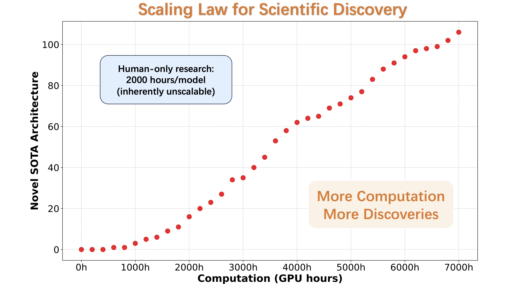
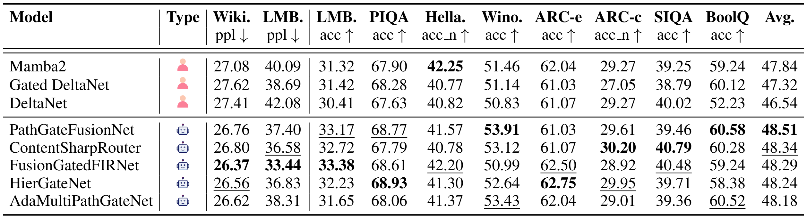
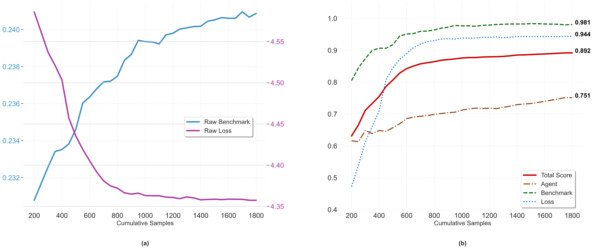

<p align="center">
<!--   -->
 <h1 align="center">AlphaGo Moment for Model Architecture Discovery</h1>
</p>
<p align="center">
 <a href="https://github.com/GAIR-NLP/ASI-Arch/blob/main/LICENSE"></a>
 <a href="https://arxiv.org/pdf/2507.18074"></a>
 <a href="https://github.com/GAIR-NLP/ASI-Arch"></a>
 <a href="https://gair-nlp.github.io/ASI-Arch/"></a>
</p>

<p align="center">
  
</p>

## 📋 Overview

This is the official repository for our work "[AlphaGo Moment for Model Architecture Discovery](https://arxiv.org/pdf/2507.18074)". We present a highly autonomous, multi-agent framework that empowers a Large Language Model (LLM) to conduct end-to-end scientific research in the challenging domain of linear attention mechanisms.


- 📖 **Paper**: Read our paper (Coming Soon)
- 💻 **Code**: Complete pipeline, database, and cognitive library available in this repository
- 🔬 **Architectures**: We open-source all 106 discovered state-of-the-art linear attention architectures

Our framework supports the following functionalities:

- **Autonomous Architecture Discovery Pipeline**:
Complete multi-agent system that autonomously hypothesizes novel architectural concepts, implements them as code, and empirically validates their performance through systematic experimentation.

- **Architecture Database**:
MongoDB-based cloud service storing all historical experimental data and enabling agent information retrieval, supporting multi-pipeline parallel execution.

- **Cognition Base**:
MongoDB-powered knowledge repository providing relevant paper cognitions and research insights to guide the autonomous research process.


*ASI-Arch autonomous research framework demonstrating AI's capability to conduct end-to-end scientific discovery, from hypothesis generation to empirical validation.*


## 🏆 Performance

ASI-Arch has successfully discovered **106 novel linear attention architectures** that achieve state-of-the-art performance across various benchmarks.


*Performance comparison of 5 selected novel linear attention architectures discovered by ASI-Arch.*

Our system demonstrates **continuous optimization capability**, consistently improving architecture quality throughout the autonomous research process.


*Performance indicators showing steady improvement in benchmark scores and consistent reduction in loss values, with composite fitness scores demonstrating rapid initial improvement followed by gradual plateau.*


<!-- *Phylogenetic tree showing evolutionary relationships among 1,773 explored architectures, with colors indicating performance scores from low (red) to high (blue).* -->

## 📋 Table of Contents

- [🚀 Get Started](#-get-started)
  - [System Requirements](#system-requirements)
  - [Installation](#installation)
  - [Environment Setup](#environment-setup)
  - [Running Architecture Discovery](#running-architecture-discovery)
- [🔧 Framework Components](#-framework-components)
- [Acknowledgement](#-acknowledgement)
- [Citation](#️-citation)

## 🚀 Get Started

#### System Requirements

- Python 3.8+
- MongoDB 4.4+
- Docker & Docker Compose
- CUDA-compatible GPU (recommended)
- Minimum 16GB RAM, 32GB recommended

#### Installation

1.  **Clone the repository:**
    ```bash
    git clone https://github.com/GAIR-NLP/ASI-Arch.git
    cd ASI-Arch
    ```
2.  **Create Conda Environment:**
    ```bash
    conda create -n asi-arch python=3.10
    conda activate asi-arch
    ```
3.  **Install Dependencies:**
    ```bash
    # Install main requirements
    pip install -r requirements.txt

    # Install PyTorch with CUDA support
    pip3 install torch==2.4.0 --index-url https://download.pytorch.org/whl/cu124

    # Install component-specific requirements
    pip install -r database/requirements.txt
    pip install -r cognition_base/requirements.txt
    ```

#### Environment Setup
The framework relies on Docker to run the Database and Cognition Base services in the background.

1.  **Start Database Service:**
    *In a new terminal*, run the following commands to launch the MongoDB container and its API server.
    ```bash
    cd database
    docker-compose up -d
    ./start_api.sh
    ```

2.  **Start Cognition Base Service:**
    *In another new terminal*, run the following commands to launch the OpenSearch container and the RAG API.
    ```bash
    cd cognition_base
    docker-compose up -d
    python rag_api.py
    ```

#### Running Architecture Discovery
Once the backend services are running, you can start the main discovery pipeline.

*In a new terminal*, execute the following:
```bash
# Ensure you are in the asi-arch conda environment
conda activate asi-arch

# Execute a single evolution cycle
cd pipeline
python pipeline.py
```

## 🔧 Framework Components

ASI-Arch is composed of three interconnected systems working in concert to achieve autonomous scientific discovery.

### 🧬 Autonomous Architecture Discovery Pipeline (`pipeline/`)

The pipeline is the core engine of ASI-Arch, executing an autonomous loop of architectural innovation. It orchestrates a team of specialized agents to systematically hypothesize, implement, and validate new linear attention mechanisms.

-   **Core Modules**:
    -   **`evolve`**: The creative heart of the system. It generates novel architectural ideas by evolving existing designs. This module includes a `Planner` to design new models, a `Code Checker` to ensure correctness, and `Deduplication` agents to foster true innovation.
    -   **`eval`**: The empirical validation module. It takes new architectures, trains them, and runs benchmarks. A `Trainer` agent handles the training process, while a `Debugger` agent can automatically analyze and fix errors during training.
    -   **`analyse`**: The analysis module. An `Analyzer` agent provides a comprehensive breakdown of an experiment's results, comparing them to baselines and previous experiments to extract key insights.
-   **Workflow**: The pipeline follows a continuous cycle: **Sample** an effective parent architecture from the database -> **Evolve** it into a new design -> **Evaluate** its performance through training and testing -> **Analyze** the results to generate insights -> **Update** the database with the new findings.
-   **Execution**: The entire loop can be started with `python pipeline/pipeline.py`.

### 🗄️ Architecture Database (`database/`)

The database serves as the collective memory of the entire research process. It stores all historical experimental data, including architectures, results, analysis, and evolutionary lineage, enabling agents to learn from past successes and failures.

-   **Technology**: Built on MongoDB for robust data storage, with a FastAPI server (`mongodb_api.py`) providing a comprehensive REST API for data access.
-   **Key Components**:
    -   **`mongodb_database.py`**: A high-level client for all database operations, managing the storage and retrieval of experimental `DataElement`s.
    -   **`candidate_manager.py`**: Maintains a curated list of the top-performing architectures (the "candidate set"). This elite set is used to guide the evolutionary process towards promising directions.
    -   **`faiss_manager.py`**: Integrates FAISS for high-speed vector similarity search. This is crucial for the `Deduplication` agent to quickly check if a new idea is truly novel or just a rehash of a previous one.
    -   **`evaluate_agent/`**: Contains a specialized `Model Judger` agent that provides a quantitative score for any given architecture based on its performance, innovation, and complexity.
-   **Usage**: The database service is launched via `database/start_api.sh`, which starts the MongoDB container and the FastAPI server.

### 🧠 Cognition Base (`cognition_base/`)

The Cognition Base acts as the system's "domain expert," providing the agents with relevant knowledge from a vast library of scientific papers. It uses a Retrieval-Augmented Generation (RAG) approach to ground the agents' decisions in established research.

-   **Technology**: Implemented as a RAG service (`rag_service.py`) that uses vector embeddings to find relevant passages from a corpus of research papers stored in the `cognition/` directory.
-   **Key Components**:
    -   **Knowledge Corpus**: The `cognition/` directory contains hundreds of JSON files, each representing a processed research paper on relevant topics like model architecture and attention mechanisms.
    -   **`rag_service.py`**: The core service that loads the knowledge corpus, creates vector embeddings for the text, and uses a vector database (like OpenSearch) for efficient retrieval.
    -   **`rag_api.py`**: A Flask-based API that allows other parts of the system, particularly the `Analyzer` and `Planner` agents in the pipeline, to query the knowledge base with natural language questions and receive the most relevant research insights.
-   **Usage**: The RAG service is started via `python cognition_base/rag_api.py`, making the knowledge base available to the entire framework.


## Acknowledgement

ASI-Arch is inspired by various open-source projects with its implementation based on [FLAME](https://github.com/fla-org/flame), [LM-Evaluation-Harness](https://github.com/EleutherAI/lm-evaluation-harness) and [Flash Linear Attention (FLA)](https://github.com/sustcsonglin/flash-linear-attention). We deeply appreciate the contributions of these teams to open-source research and development.

## Citation

Please cite this work if it contributes to your research:

```bibtex
@misc{liu2025alphagomomentmodelarchitecture,
      title={AlphaGo Moment for Model Architecture Discovery}, 
      author={Yixiu Liu and Yang Nan and Weixian Xu and Xiangkun Hu and Lyumanshan Ye and Zhen Qin and Pengfei Liu},
      year={2025},
      eprint={2507.18074},
      archivePrefix={arXiv},
      primaryClass={cs.AI},
      url={https://arxiv.org/abs/2507.18074}, 
}
``` 
