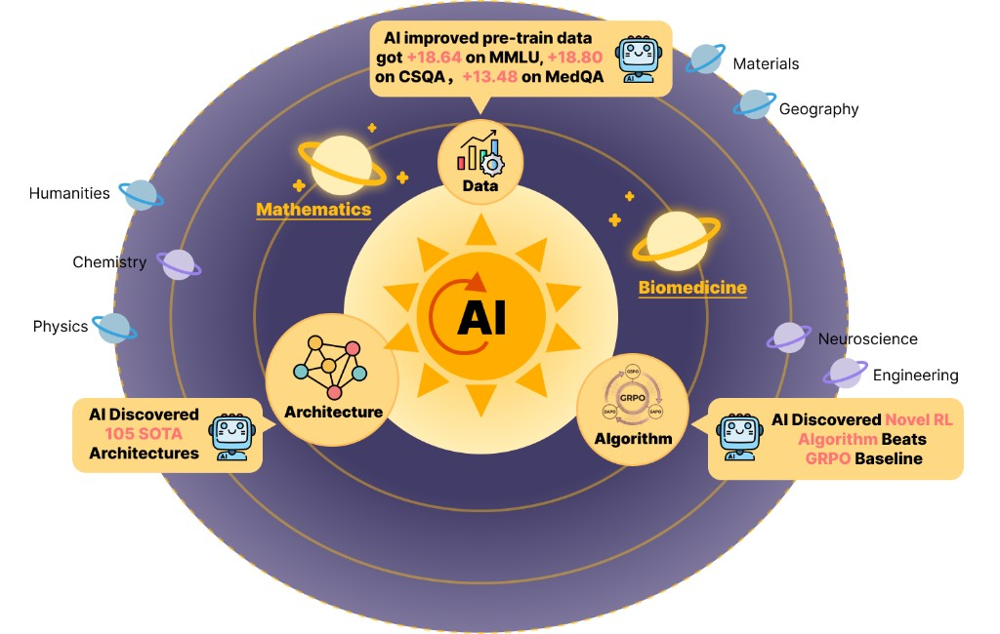

# ASI-Evolve — Let AI Do the Research, You Keep the Insight


> **"What if you could run a tireless AI researcher on your hardest problem — one that reads the literature, designs experiments, runs them, and learns from every failure?"**

That's ASI-Evolve. It is a general agentic framework that closes the loop between **knowledge → hypothesis → experiment → analysis** — and repeats it autonomously, round after round, until it finds something that works.

We built it for AI research. But the loop doesn't care about domain.  
A financial analyst, a biomedical engineer, a climate scientist, or a game developer can all plug their own problem into ASI-Evolve and let it search for better solutions than any human has time to manually explore.

**Quick try:** Install the Evolve Agent Skill under `skills/evolve` to have a lightweight first pass.

<div align="center">

[](https://github.com/GAIR-NLP/ASI-Evolve/blob/main/assets/paper.pdf)
[](https://arxiv.org/abs/2603.29640)

</div>

---

## What ASI-Evolve Proved

The paper validated ASI-Evolve on three hard AI problems — each requiring expensive compute, open-ended search, and multi-dimensional feedback:

| Domain | What It Discovered | Gain |
|---|---|---|
| **Neural Architecture Design** | 105 SOTA linear attention architectures | **+0.97 pts** over DeltaNet (≈3× recent human gains) |
| **Pretraining Data Curation** | Evolved pipeline that selects cleaner training data | **+3.96 pts** avg, **+18 pts** on MMLU |
| **RL Algorithm Design** | Novel optimization mechanisms with mathematical innovations | **+12.5 pts** on AMC32 vs GRPO |
| **Biomedical (Drug-Target Interaction)** | Stronger architecture for cold-start generalization | **+6.94 AUROC** |

These are not toy benchmarks. These are real, frontier-level results — produced autonomously.

---

## The Core Loop (Works in Any Domain)

| Step | Action |
|---|---|
| 1 | **LEARN** — retrieve relevant prior knowledge |
| 2 | **DESIGN** — propose the next candidate program/idea |
| 3 | **EXPERIMENT** — run it and collect metrics |
| 4 | **ANALYZE** — turn results into reusable lessons |

> Repeat the loop and improve each round.

Three agents drive this loop:

- **Researcher** — reads the database and cognition store, proposes the next candidate
- **Engineer** — executes the candidate and collects structured metrics
- **Analyzer** — distills outcomes into transferable lessons for future rounds

Two memory systems keep the loop from going in circles:

- **Cognition Store** — inject your domain knowledge, papers, or heuristics upfront so the AI doesn't start from zero
- **Experiment Database** — every trial is stored with its motivation, code, result, and analysis; parent selection uses UCB1, greedy, random, or MAP-Elites island sampling

---

## Who Should Use This

You don't need to be an AI researcher. You need:

1. **A problem where better code = better outcome** — optimization, algorithm design, pipeline tuning, simulation strategy
2. **An evaluation script** — something that takes a program and returns a score
3. **Some domain knowledge** — papers, rules of thumb, known good approaches

If you have those three things, ASI-Evolve can search the space for you.

**Examples across domains:**

| Industry | Problem You Can Throw At It |
|---|---|
| 🧬 Biomedicine | Drug-target interaction models, protein folding strategies, clinical trial algorithms |
| ⚡ ML Infra | Inference schedulers, KV-cache eviction policies, batching strategies, kernel tiling |
| 🌍 Climate / Energy | Grid load-balancing heuristics, carbon footprint optimization pipelines |
| 🎮 Game AI | Bot strategies, procedural level generation algorithms, reward shaping functions |
| 🏭 Manufacturing | Quality control classifiers, scheduling heuristics, defect detection pipelines |
| 🔬 Materials Science | Crystal structure search algorithms, synthesis route optimization |
| 📦 Logistics | Routing algorithms, warehouse assignment policies, demand forecasting models |

---

## Walkthrough: Inference Throughput Optimization

> **Scenario:** You're an ML infra engineer. Your LLM serving system uses a fixed continuous-batching scheduler. You want to automatically discover a better request-scheduling policy that maximizes throughput while keeping P99 latency under budget — without spending weeks hand-tuning heuristics.

### 1. Clone and install

```bash
git clone https://github.com/GAIR-NLP/ASI-Evolve.git
cd ASI-Evolve
pip install -r requirements.txt
```

### 2. Create your experiment

```bash
mkdir -p experiments/infer_scheduler/prompts
```

```
experiments/infer_scheduler/
├── input.md          ← problem description
├── config.yaml       ← API key + overrides
├── initial_program   ← baseline scheduler to evolve from
├── init_cognition.py ← inject your domain knowledge
├── evaluator.py      ← benchmark the candidate scheduler
└── eval.sh           ← shell wrapper called each round
```

### 3. Describe the problem (`input.md`)

```markdown
# LLM Serving Scheduler

Write a Python function `schedule(queue, gpu_mem_free_gb)` that selects
a batch of requests from `queue` (list of dicts with keys: seq_len, priority,
wait_ms) given available GPU memory, and returns a list of selected request ids.

Optimize for: tokens/sec throughput (primary), P99 latency ms (must stay < 500ms).
```

### 4. Baseline program (`initial_program`)

```python
def schedule(queue, gpu_mem_free_gb):
    """FCFS baseline — just take requests in arrival order."""
    budget = int(gpu_mem_free_gb * 1024)  # rough token budget
    selected, used = [], 0
    for req in sorted(queue, key=lambda r: r["wait_ms"], reverse=True):
        if used + req["seq_len"] <= budget:
            selected.append(req["id"])
            used += req["seq_len"]
    return selected
```

### 5. Seed the cognition store (`init_cognition.py`)

```python
from cognition.store import CognitionStore

store = CognitionStore(storage_dir="experiments/infer_scheduler/cognition_data")
store.add([
    {
        "title": "Continuous Batching",
        "content": "Orca-style iteration-level scheduling avoids head-of-line blocking "
                   "by preempting long requests and inserting shorter ones mid-flight.",
    },
    {
        "title": "Sequence Length Bucketing",
        "content": "Grouping requests by similar sequence length reduces padding waste "
                   "and improves GPU utilization significantly.",
    },
    {
        "title": "Priority + Starvation",
        "content": "Pure priority scheduling causes starvation. Age-weighted priority "
                   "(priority * log(1 + wait_ms)) balances latency and throughput.",
    },
])
```

```bash
python experiments/infer_scheduler/init_cognition.py
```

### 6. Evaluator (`evaluator.py` + `eval.sh`)

```python
import importlib.util, sys, json
from benchmark import run_serving_simulation  # your internal benchmark harness

def load(path):
    spec = importlib.util.spec_from_file_location("candidate", path)
    mod = importlib.util.module_from_spec(spec); spec.loader.exec_module(mod)
    return mod.schedule

if __name__ == "__main__":
    fn = load(sys.argv[1])
    result = run_serving_simulation(scheduler_fn=fn, trace="traces/sharegpt_1k.jsonl")
    # score = throughput; constraint violation penalizes automatically
    score = result["tokens_per_sec"] if result["p99_latency_ms"] < 500 else 0
    print(json.dumps({"score": score, "metrics": result}))
```

```bash
# eval.sh
#!/bin/bash
python /path/to/experiments/infer_scheduler/evaluator.py "$1"
```

### 7. Run

```bash
python main.py \
  --experiment infer_scheduler \
  --steps 40 \
  --sample-n 3 \
  --eval-script /path/to/experiments/infer_scheduler/eval.sh
```

ASI-Evolve will iterate through scheduling policies — from simple heuristics to multi-factor priority functions with dynamic chunking — and write a structured lesson after every trial. After 40 rounds you have a ranked database of every policy tried, why each worked or failed, and the best-performing code ready to deploy.

---

## What ASI-Evolve Does That You Can't Do Manually

| Manual Research | ASI-Evolve |
|---|---|
| Try 5–10 ideas per week | 50–200 candidates per run |
| Knowledge stays in one person's head | Every insight written to the database |
| Cold start on each new hypothesis | Cognition store primes every round |
| Hard to know why something worked | Analyzer explains every outcome |
| Results hard to reproduce | Full experiment tree stored on disk |

---

## Repository Layout

```
ASI-Evolve/
├── main.py                         ← entry point
├── config.yaml                     ← global defaults
├── pipeline/                       ← Researcher, Engineer, Analyzer agents
├── cognition/                      ← cognition store (embedding + FAISS)
├── database/                       ← experiment database (nodes + sampling)
├── utils/
└── experiments/
    ├── circle_packing_demo/        ← included runnable demo
    └── best/circle_packing/        ← top programs from our ablation runs
```

> **Skill vs. repository:** When using the Skill, prior experiment traces and instructions accumulate in the model context, and the assistant is not constrained to the same fixed control flow as the official pipeline. End-to-end search quality and throughput are usually lower than when you run this repository directly. Use the Skill for a quick try-out; for very complex or tightly controlled work, prefer cloning and running from here.

---

## Installation

```bash
pip install -r requirements.txt
```

Requirements:
- Python 3.10+
- `bash` and `python3` on your system path
- Any OpenAI-compatible API endpoint (GPT-4o, Claude, Gemini, local models via LiteLLM, etc.)
- Optional: Weights & Biases for experiment tracking

---

## Quick Start (Circle-Packing Demo)

The included demo evolves a program to pack 26 circles in a unit square — a clean benchmark used in our ablation studies.

```bash
# Initialize the cognition store
python experiments/circle_packing_demo/init_cognition.py

# Run 10 evolution steps
python main.py \
  --experiment circle_packing_demo \
  --steps 10 \
  --sample-n 3 \
  --eval-script /path/to/experiments/circle_packing_demo/eval.sh
```

ASI-Evolve reaches SOTA-level circle-packing results in as few as **17 rounds**.

---

## Configuration Reference

Configuration merges in this order (later overrides earlier):

1. `config.yaml` at repository root
2. `experiments/<name>/config.yaml`
3. An explicit file passed with `--config`

Key settings:

| Key | What It Controls |
|---|---|
| `api.model` | The LLM driving all agents |
| `pipeline.sample_n` | How many historical nodes to show the Researcher each round |
| `pipeline.parallel.num_workers` | Parallel evolution workers (2–4 for production) |
| `database.sampling.algorithm` | `ucb1` / `greedy` / `random` / `island` |
| `cognition.retrieval.top_k` | How many cognition items to retrieve per round |

---

## Citation

If you use ASI-Evolve in your work, please cite:

```bibtex
@misc{asi_evolve_2026,
  title   = {ASI-Evolve: AI Accelerates AI},
  author  = {Xu, Weixian and Mi, Tiantian and Liu, Yixiu and Nan, Yang and Zhou, Zhimeng and Ye, Lyumanshan and Zhang, Lin and Qiao, Yu and Liu, Pengfei},
  year    = {2026},
  note    = {SJTU / SII / GAIR. https://github.com/GAIR-NLP/ASI-Evolve}
}
```

---

<div align="center">

**ASI-Evolve is open-source and ready for your domain.**  
Fork it. Point it at your problem. Let it run.

[📄 Paper](https://github.com/GAIR-NLP/ASI-Evolve/blob/main/assets/paper.pdf) · [🐛 Issues](https://github.com/GAIR-NLP/ASI-Evolve/issues) · [💬 Discussions](https://github.com/GAIR-NLP/ASI-Evolve/discussions)

</div>
