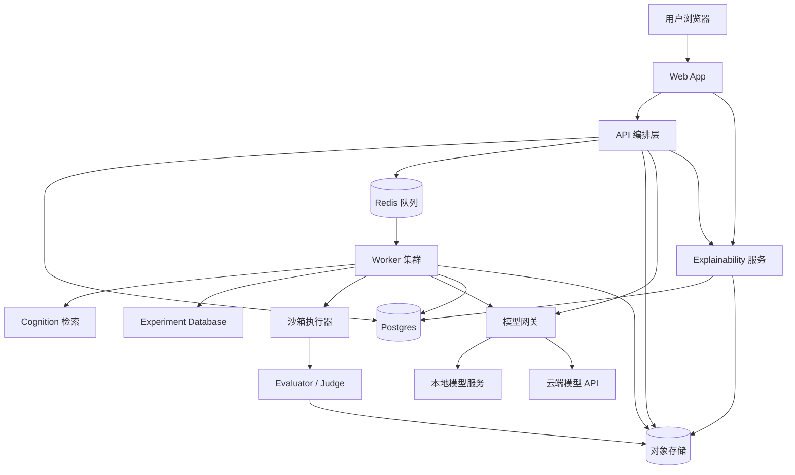

# R U Socrates 从 ASI-Evolve 到大众化端到端产品的深度研究与实施蓝图

## 执行摘要

对 entity["organization","GAIR-NLP","nlp research group"] 在 entity["company","GitHub","developer platform"] 上公开的 ASI-Evolve 仓库进行代码与论文双重审计后，可以得出一个非常明确的结论：它已经具备“研究循环自动化引擎”的核心骨架，但还不是“普通用户可直接上手的终端产品”。现有实现已经覆盖了可恢复的实验管线、Researcher / Engineer / Analyzer 多代理协作、基于 embeddings 与 FAISS 的 cognition / database 双记忆系统、基于 `eval.sh` 的外部评测接入，以及基于 `prompts/*.jinja2` 的模板机制；但它仍以 CLI、实验目录、脚本调用、结果文件解析为中心，适合研究员或工程师，而不适合无机器学习背景的公众用户直接操作。论文则进一步证明了这套框架在“知识→假设→实验→分析”的闭环上是成立的，且面向的是高成本、长周期、复杂反馈的研究任务。citeturn5search2turn20search2turn20search3turn26view0turn27view2turn31view1turn32view3turn34view0turn38view0turn38view3turn7view0turn8view0turn9view0turn15view0

因此，R U Socrates 不应当只是“把仓库包一层 Web UI”，而应当被定义为一个**面向普通用户的、解释优先的、任务编排型产品**：它的核心价值不再是“让 AI 自动做研究”，而是“把研究型自动化能力收敛成一个人人可理解、可运行、可验证、可发布的 Socratic 工作流工具”。换句话说，产品目标需要从“自动科研框架”重构为“面向公众的提问、推理、评测、解释与复现平台”，并把原仓库中的模型推理、提示模板、评测、数据集处理、解释生成，全部提升为可视化、可审计、可导出的产品能力。这个方向既尊重现有代码资产，也避免了把研究管线直接暴露给终端用户所带来的复杂度和安全风险。citeturn19search0turn26view2turn32view1turn32view4turn34view0turn38view2turn38view4

在路线选择上，本报告的主张是：**产品上采用“Web first、PWA second、Desktop later”的节奏；工程上采用“前端应用 + API 编排层 + 异步 worker + 模型网关 + 沙箱评测”的分层架构；发布上采用“先 RC、后稳定版”的 GitHub Release 流程；授权上采用“严格区分 open source 与 non-commercial source-available”的双轨表述**。就术语准确性而言，“非商用开源”并不是一个严谨的说法，因为开源定义本身不允许按商业用途做歧视性限制；如果必须限制商业用途，应使用 source-available 许可，而不是继续宣称其为 open source。citeturn10search1turn10search25turn18search2turn18search19turn18search3turn10search11

本报告的最终建议是：如果你希望 R U Socrates 由 entity["people","ceaserzhao","oasis company author"] 作为 entity["company","Oasis Company","software company"] 的作品进行长期运营，最稳妥的办法不是把整个 fork 直接改成“非商用开源”，而是采取**分层授权**：保留继承自上游的 Apache-2.0 部分及其归属与 NOTICE 要求，把新增的品牌层、Web 应用层、模板资产与发行包装层作为单独模块管理；若一定要限制商业用途，则应把这些新增层采用 source-available 方案发布，并明确与上游 Apache 代码的边界。这里不是法律意见，但从许可证文本与开源定义出发，这是当前风险最低、叙事最清晰、也最利于后续发布的路径。citeturn17search0turn17search2turn17search20turn10search1turn10search25turn18search3

## 现状审计与改造目标

当前仓库的骨架非常清晰。根目录公开可见的主要部分包括 `assets/`、`cognition/`、`database/`、`experiments/`、`pipeline/`、`skills/evolve/`、`utils/`、`config.yaml`、`main.py` 与 `requirements.txt`；入口 `main.py` 仍是命令行方式，核心运行单元仍然是 `Pipeline`，每次以 experiment 名称、步数、采样数和 evaluator shell 脚本为输入进行演化。README 也把标准使用方式描述为“创建 `experiments/<name>/` 目录、编写 `input.md`、`initial_program`、`init_cognition.py`、`evaluator.py` 和 `eval.sh`，然后执行 `python main.py ...`”。这意味着当前产品心智模型不是“打开网页、填表、点击运行”，而是“创建研究实验目录并通过脚本驱动”。citeturn23view0turn19search0turn20search3

在实现层面，`Pipeline` 会加载 experiment 级 prompt 目录、初始化数据库与 cognition 存储，并实例化 Manager、Researcher、Engineer、Analyzer；Researcher 支持 diff-based evolution 和 full rewrite 两种模式，Engineer 会把候选代码写入实验目录后执行 `bash` 脚本并读取 `results.json`，且明确要求评测结果中存在 `eval_score` 字段；Analyzer 则把代码、结果和“最佳被采样节点”的上下文一并压缩成可复用的分析文本；Database 和 Cognition 都使用嵌入模型与 FAISS 做本地相似检索。换句话说，仓库已经具备“任务编排 + 检索增强 + 评测回路 + 经验积累”的核心能力，但这些能力全都暴露在工程接口之上，而不是产品接口之上。citeturn26view0turn27view0turn27view2turn31view1turn32view1turn32view3turn32view4turn34view0turn38view0turn38view2turn38view3turn38view4

配置与依赖也进一步揭示了当前系统的定位。仓库要求 Python 3.10+、`bash`、`python3`、任意兼容 entity["company","OpenAI","ai company"] 接口的模型端点，以及可选的 Weights & Biases；`requirements.txt` 只包含 `openai`、`pyyaml`、`jinja2`、`numpy`、`faiss-cpu`、`sentence-transformers` 和 `wandb`。这是一组非常“研究/原型”风格的依赖：轻量、可组装、可替换，但缺少完整产品所需的身份、队列、审计、前端、沙箱和发布配置。citeturn20search1turn20search2turn19search0

与此同时，仓库目前没有公开发布任何 GitHub Releases，根目录公开可见内容中也没有显示 `.github/workflows/`、`CONTRIBUTING.md`、`SECURITY.md`、`CODE_OF_CONDUCT.md` 等常见发布与治理文件。这并不妨碍研究使用，但会直接影响版本语义、安装体验、贡献流程与后续生态扩展。对于一个面向公众的工具来说，这些都是必须补上的“产品基础设施”。citeturn4search0turn23view0turn16search0turn16search4turn16search5turn16search33

### 现有能力与产品缺口

| 维度 | 现有仓库状态 | 面向 R U Socrates 的缺口 | 改造结论 |
|---|---|---|---|
| 运行入口 | CLI + `main.py` + `eval.sh` citeturn20search3turn19search0 | 需要浏览器入口、表单化配置、任务列表、运行状态页 | 必须做应用壳层 |
| Prompt 模板 | `prompts/*.jinja2`，Manager 可生成 prompt，Researcher 可使用 diff/full mode citeturn27view0turn27view2turn31view1 | 需要模板市场、模板版本、模板解释与预览 | 保留内核，新增 UI/模板治理 |
| 评测 | Engineer 运行 shell，读取 `results.json`，要求 `eval_score` citeturn32view1turn32view3turn32view4 | 需要可视化指标、失败重试、资源限额、任务取消 | 改为异步编排服务 |
| 记忆系统 | Database + Cognition，均基于 embeddings + FAISS 检索 citeturn38view0turn38view2turn38view3turn38view4 | 需要用户可理解的“知识库/历史”，“为什么召回这些信息” | 做面向用户的解释层 |
| 结果解释 | Analyzer 生成压缩分析文本 citeturn34view0 | 需要风险提示、证据链、来源面板、导出报告 | 强化 explainability UX |
| 发布治理 | 无 Releases，可见目录未显式展示发布自动化与社区健康文件 citeturn4search0turn23view0turn16search0turn16search33 | 需要语义化版本、资产发布、社区约束、漏洞披露 | 需完整补建 |
| 目标用户 | README 明确偏“有问题定义、评测脚本、领域知识”的人群 citeturn5search2turn19search0 | 普通用户不知道如何写 evaluator / seed cognition | 需要预设工作流与引导式体验 |

## 产品范围与用户体验定义

R U Socrates 的默认目标用户应定义为**无 ML 专业背景、但有明确任务目标的普通公众**。这类用户并不想知道 Researcher、Engineer、Analyzer 的内部细节，他们想做的是：上传文本、提出问题、选择模板、点击运行、看懂结果、导出报告、必要时复现流程。因此，产品边界必须重新划分：Research pipeline 继续存在，但只作为底层执行内核；面向用户的产品层则重塑为“任务创建—模板选择—数据输入—执行监控—结果解释—一键发布”的连续体验。这个定位与上游“面向昂贵、开放、长周期研究循环”的目标并不冲突，只是把它约束成了更安全、更易懂的任务子集。citeturn8view0turn9view0turn15view0turn19search0

从功能上看，我建议把产品范围拆成三层。第一层是公众可立即使用的 **MVP**：任务创建、示例数据导入、模板库、单轮/多轮运行、结果摘要、解释面板、导出 Markdown/PDF 报告。第二层是 **V1**：数据集管理、评测工作流、版本化 prompt、分享只读链接、模型切换、本地/云端模式切换、运行审计日志。第三层是 **V1.5**：协作空间、批量任务、可视化基准对比、插件化 evaluator、实验复现包、桌面端封装。这样的切分可以让“普通用户立即可用”和“研究能力不中断”同时成立。citeturn19search0turn26view2turn32view1turn34view0

### 功能阶段划分

| 阶段 | 用户能做什么 | 必须具备的产品能力 | 建议暂缓 |
|---|---|---|---|
| MVP | 新建任务、上传文本、选模板、运行、看结果、导出报告 | Web 应用、任务状态、解释面板、报告导出、基本身份系统 | 多人协作、插件市场 |
| V1 | 组织模板、管理数据集、对比结果、切换模型、复制任务 | Prompt 版本控制、数据集页、评测页、模型网关、运行历史 | 桌面端、移动离线包 |
| V1.5 | 团队共享、批处理、只读分享、实验复现 | 工作区、权限模型、队列扩展、复现捆绑包 | 企业 SSO、复杂计费 |

### 核心功能定义

| 功能域 | R U Socrates 中的产品化形态 | 与原仓库的映射 |
|---|---|---|
| 模型推理 | “模型提供者”下拉、成本预估、响应流式输出 | 现有 OpenAI-compatible LLM client 与模型端点配置 citeturn20search2turn26view0 |
| Prompt 模板 | 模板库、模板预览、模板版本、模板解释 | `prompts/*.jinja2` 与 PromptManager citeturn27view0turn31view1 |
| 评测 | 评分卡、阈值、失败原因、重跑 | Engineer 的 `eval.sh` / `results.json` / `eval_score` citeturn32view1turn32view3turn32view4 |
| 数据集处理 | 文件上传、样例集、标签、切分、运行绑定 | `experiments/<name>` 中的 evaluator 与外部数据输入模式 citeturn19search0 |
| 可解释性 | “为什么得到这个答案”“用了哪些知识”“失败在哪里” | Analyzer + Cognition + Database 检索与分析 citeturn9view0turn34view0turn38view2turn38view4 |
| 复现与发布 | 任务快照、导出配置、生成 release notes | 现有 steps 目录与可恢复 pipeline 状态 citeturn26view0turn26view2 |

### 支持平台建议

| 平台 | 建议级别 | 说明 |
|---|---|---|
| Web App | 必选 | 默认交付面，覆盖最大用户面 |
| PWA | 强烈建议 | 允许“安装到桌面”、基础离线壳层、移动端适配 |
| Desktop | 可选后续 | 建议用 Tauri 封装本地模式，适合隐私优先用户 |
| Mobile 原生 | 暂不优先 | 公众用户的主要价值在“查看结果”而非“完整配置复杂任务” |

## 技术架构与部署方案比较

从架构上看，最不应该做的事情是把当前仓库直接塞进单个 Web 进程里。因为论文与现有实现都表明，这个系统天然包含外部评测、超时控制、日志解析、历史节点采样、知识检索和分析压缩等重操作；而研究任务本身又常常产生长时运行和多维输出。将其直接绑定到同步 Web 请求，会把 CLI 的易用性问题换成 Web 的稳定性问题。更合理的方式，是把“浏览器交互”和“实验执行”彻底解耦。citeturn8view0turn9view0turn15view0turn32view4

我建议的目标架构是：前端用 Next.js 或等价现代 Web 框架承载应用壳与页面路由；后端用 FastAPI 承担 API、认证、任务创建与结果读取；异步队列承载实际 experiment execution；worker 负责 prompt 组装、cognition/database 检索、模型调用、评测脚本执行与结果归档；模型侧统一经过 model gateway，使本地 vLLM / Ollama 与云端 API 在上层呈现一致接口；真正执行候选代码和 evaluator 的部分必须放进受限沙箱容器，禁止任意宿主机访问。这样做既能复用当前 Python 代码，又能在产品层引入多租户控制、取消任务、追踪成本与审计日志。citeturn26view0turn27view0turn27view2turn32view1turn32view4turn13search12turn13search13turn13search18

### 推荐系统架构图



上图对应的是“产品层—编排层—执行层—模型层”的四段式设计。它与现有 `Pipeline + Researcher + Engineer + Analyzer + Cognition + Database` 的职责边界是兼容的，只是把它们从单进程/实验目录重构成了可并发的服务边界。citeturn26view0turn27view2turn31view1turn32view1turn34view0turn38view0turn38view3

### 架构方案对比

| 方案 | 结构 | 优点 | 缺点 | 适合阶段 | 结论 |
|---|---|---|---|---|---|
| 单体原型 | 前端/后端/执行都在一台机器 | 开发快、成本最低、便于 Demo | 难做隔离、任务一多就卡、失败面大 | 内部验证 | 仅限最初两周 |
| 分层生产方案 | Web + API + Queue + Worker + 沙箱 + 模型网关 | 稳定、可扩展、可审计、易做权限与成本控制 | 工程复杂度更高 | Beta 与正式发布 | **推荐主线** |
| 本地优先方案 | 桌面/PWA + 本地模型 + 本地数据库 | 隐私最好、离线可用 | 安装门槛高、硬件分布不均、支持成本高 | 隐私版、机构版 | 作为后续分支 |

### 后端技术栈建议

| 模块 | 推荐技术 | 选择理由 |
|---|---|---|
| Web 前端 | Next.js / React | 页面、表单、结果页、任务流很适合组件化管理 |
| API | FastAPI | 与现有 Python 内核自然衔接，适合异步接口与 OpenAPI 文档 |
| 队列 | Redis + Celery / Dramatiq / RQ | 便于把长任务从请求线程中分离 |
| 数据库 | PostgreSQL | 任务、模板、用户、运行记录、审计日志都适合关系模型 |
| 对象存储 | S3 兼容存储 | 保存结果文件、导出包、评测附件、日志归档 |
| 沙箱 | Docker + seccomp / gVisor / Firecracker | 评测脚本和候选代码必须隔离执行 |
| 可观测性 | OpenTelemetry + Prometheus + Grafana + Sentry | 追踪慢任务、失败率、模型调用成本 |

### 模型托管与提供商比较

| 方案 | 适配方式 | 费用特征 | 优势 | 风险/限制 | 何时使用 |
|---|---|---:|---|---|---|
| 本地 Ollama | 统一接入本地 API | 云成本可接近 0；但需要本地硬件 | 安装在 macOS / Windows / Linux；默认本地 API 地址为 `localhost:11434/api`；模型文件可能占用数十到数百 GB。citeturn13search1turn13search13turn13search5turn13search21 | 用户机器性能差异大；桌面支持成本高 | 个人隐私优先版 |
| 自托管 vLLM | 作为 OpenAI-compatible server 部署 | 取决于自有 GPU/云 GPU | 可作为 OpenAI API 替代；适合统一上层接口；支持 GPU/CPU 等多种后端。citeturn13search12turn13search4turn13search16 | 需要自己处理 GPU、伸缩与日志 | 主产品推荐 |
| entity["company","Hugging Face","ai platform"] Inference Endpoints | 托管端点 | 起步价可低至 $0.033/h；文档也给出“按需可低至 $0.5/GPU/h”的量级。citeturn12search2turn12search6turn12search18 | 上手最快，适合 MVP 和 Beta | 成本随常驻时间上升；供应商锁定较强 | MVP / Beta |
| entity["company","RunPod","gpu cloud"] Serverless | GPU 按秒付费 | L4/A5000/3090 24GB 级别约 $0.00019/s，即约 $0.684/h；L40/L40S 48GB 级别约 $0.00053/s。citeturn12search5 | 成本弹性好，适合突发流量 | 需要自己搭 API 与存储治理 | Beta / 成本敏感阶段 |
| entity["company","Google Cloud","cloud platform"] Run / GPU | 容器服务 + GPU | L4 约 $0.0001867/s，约 $0.672/h；但 GPU 服务要求 instance-based billing，最小实例空闲也计费。citeturn12search3turn12search7 | 云原生整合好，适合正式环境 | 空闲浪费风险大 | 稳定生产环境 |
| entity["company","Modal","serverless gpu"] | Serverless GPU/函数 | 官方强调 autoscale 与按计算付费，Starter 为 $0 + compute，适合突发工作负载。citeturn12search0turn13search28 | 部署体验好 | 成本与容量规划需结合实际负载测算 | 快速试运行 |

### 建议的模型策略

如果你要优先把产品做出来，而不是优先优化模型基础设施，最佳顺序是：

第一阶段使用“**云端一个、 本地一个**”的双后端并存。也就是，产品默认提供一个托管推理后端给普通用户直接使用，同时保留本地模式，让高级用户或机构用户可切换到本地 vLLM / Ollama。这个方案与当前仓库“任何 OpenAI-compatible endpoint 都可接入”的设计天然契合，也最利于把“普通用户体验”和“隐私/成本诉求”同时照顾到。citeturn20search2turn13search12turn13search13turn13search18

第二阶段再做 rate limit、token 预算、模型降级策略与网关路由。因为普通用户最容易失控的不是模型质量，而是成本与等待时间。模型网关层应当统一记录：请求者、模板版本、模型版本、token 用量、平均时延、失败原因、缓存命中率。这样 Result 页才能把“结果怎么来的”和“资源花到哪里去了”同时讲清楚。citeturn13search22turn13search18

### 隐私与资源要求

对公众产品而言，隐私不应做成一行免责声明，而应做成产品的明确选项。我建议直接把“运行模式”分成三档：**本地优先**、**托管云端**、**机构私有部署**。本地优先意味着文本、模板与中间结果尽可能不出用户设备；托管云端意味着用户把便利性交给你；机构私有部署则面向学校、智库、企业内部环境。由于 Ollama 的安装文档明确提示模型存储会消耗额外的数十到数百 GB，本地模式必须在 UI 上做硬件提示；而使用 GPU 容器云时，则必须在结果页上显示本次任务的大致成本与“是否可离线复现”。citeturn13search5turn13search21turn13search13turn12search7

| 场景 | 最低建议资源 | 适合用途 |
|---|---|---|
| 本地轻量模式 | 现代笔记本 + 小模型 / API 中转 | 模板体验、文本解释、低频使用 |
| 单机开发环境 | 8 vCPU / 16–32 GB RAM / 1 块开发级 GPU 或云 API | 前后端联调、功能验证 |
| 公测环境 | 2 台 API/Worker + 独立 Redis/Postgres + 弹性 GPU | 100–1000 日任务级别 |
| 正式生产 | 独立 API、队列、对象存储、审计日志、可伸缩 GPU 池 | 面向公众稳定服务 |

## 界面设计与交互线框

面向普通用户的关键，不是把配置项变多，而是把复杂性重新组织成“可循序理解”的页面。R U Socrates 的主界面应该围绕三类页面构建：**首页/模板页**、**工作台/运行页**、**结果/发布页**。首页负责把任务抽象讲清楚；工作台负责把底层 research loop 收敛成少量用户可理解的控制项；结果页负责把“结论、证据、风险、可复现动作”统一放在同一处。这个界面策略与现有 `Pipeline` 的阶段性工作流相匹配，同时避免把 engineer 的脚本、研究节点和原始日志直接暴露给用户。citeturn26view2turn31view1turn32view1turn34view0

以下线框图是基于本报告建议而绘制的产品草图，不是现有仓库的截图。它们体现的核心原则是：**默认简单、逐步显式化、随时解释、结果可发布**。


### 页面级信息架构

| 页面 | 核心目标 | 必备组件 |
|---|---|---|
| 首页 | 让新用户在 30 秒内理解“这工具能帮我做什么” | 新建任务按钮、模板推荐、透明度承诺、最近任务 |
| 工作台 | 让任务创建与运行过程具备“表单感”而非“脚本感” | 任务配置、模型选择、隐私级别、状态面板、运行日志 |
| 结果页 | 让用户能“看懂、下载、分享、复现” | 评分摘要、证据与解释、风险提示、发布操作区 |

### 交互原则

第一，**把研究术语翻译成公众术语**。例如，不显示“Researcher sampled 3 nodes”，而显示“系统参考了 3 条历史经验”；不显示“cognition retrieval top_k=3”，而显示“系统引用了 3 条知识片段”；不显示“eval_score missing”，而显示“本次任务没有产生可评分结果”。这种翻译不是 cosmetic，而是产品成败的关键。citeturn27view2turn32view3turn34view0turn38view2turn38view4

第二，**结果必须解释为什么，而不只是给出分数**。Analyzer 在原仓库中的作用，就是把复杂实验结果压缩成可复用的自然语言分析；R U Socrates 应把这种能力提升成结果页的第一公民：每个结论旁边都要能展开“证据”“推理”“风险”“替代建议”。这将成为它区别于普通聊天工具的核心卖点。citeturn9view0turn34view0

第三，**任何成本、隐私和复现相关信息都应该可显式查看**。普通用户并不需要一开始就学会这些，但只要他们愿意点开，就必须看得到：使用了哪个模型、哪个模板版本、是否上传到云端、花费了多少 token 或 GPU 时间、如何重新运行。否则产品一旦被用于教育、咨询或内容生产，就会在信任层面出现明显短板。citeturn13search22turn12search7turn34view0

## 路线图、工时、成本与测试

从项目管理角度看，这项改造不应该“一步到位”，而应该以发布为中心倒排。最合理的工程节奏是先做一个可演示、可打 tag、可发 release candidate 的版本，而不是先把所有高级能力做全。因为当前仓库还没有 Release 资产，最佳策略是用第一个 RC 版本尽早把安装、运行、导出、文档和回滚链路打通。GitHub 官方文档明确说明 release 建立在 Git tags 之上，而自动生成的 release notes 也可以列出合并 PR、贡献者和完整 changelog；同时，GitHub 也建议在合适场景下先创建 draft release，再附加资产并发布。citeturn10search4turn10search0turn11search2turn11search0

### 建议路线图

| 里程碑 | 时间 | 产出 | 主要负责人 | 估算人周 |
|---|---|---|---|---:|
| 需求冻结与技术审计 | 第 1 周 | 产品 PRD、架构 RFC、授权方案草案 | 产品 + 技术负责人 | 1–1.5 |
| 内核包装与 API 化 | 第 2–3 周 | 将 Pipeline 封装为服务接口，定义 Job/Run/Result 模型 | 后端 | 2–3 |
| MVP Web 壳层 | 第 3–5 周 | 首页、工作台、结果页、登录、基础任务管理 | 前端 + 设计 | 3–4 |
| Worker / 队列 / 沙箱 | 第 4–6 周 | 异步执行、重试、取消、超时、容器隔离 | 后端 + 平台 | 2–3 |
| 解释性与导出 | 第 5–6 周 | 证据面板、报告导出、复现包 | 前后端 | 1.5–2 |
| 文档与社区治理 | 第 6–7 周 | README、贡献指南、安全政策、Issue 模板 | 维护者 | 1–1.5 |
| RC 发布 | 第 7 周 | `v0.1.0-rc1` draft release、Docker 镜像、安装说明 | 维护者 + 平台 | 0.5–1 |
| 公测与修复 | 第 8–10 周 | 稳定性修复、性能优化、Beta 反馈闭环 | 全员 | 2–3 |

如果团队规模是 3 人（前端 1、后端 1、全栈/平台 1），这条路线通常可以在 8–10 周产出一个像样的公测版；如果只有 1–2 人，则更现实的时间是 10–14 周。这里的关键不是编码速度，而是“研究内核 → 产品执行器 → 面向公众的解释体验”之间有两次抽象转换，任何一次偷工减料都会在发布后暴露出来。

### 成本估算

以下成本分为“研发期”和“运行期”两类。研发人力成本强烈取决于团队所在地与薪资结构，因此这里只给人周，不给薪资绝对值；基础设施则尽量基于官方价格页做区间估算。

| 场景 | 假设 | 估计成本 |
|---|---|---:|
| 研发期最小云成本 | 用一个最低配置托管端点 + 常规 Web 基础设施 | 约 $50–$300 / 月 |
| 公测小流量 GPU 成本 | 使用 RunPod 24GB 级 GPU，按 8 小时/天运行 | 约 $164 / 月，仅 GPU；不含 API、DB、存储。citeturn12search5 |
| 公测小流量 Cloud Run GPU | 使用 L4，按 8 小时/天运行 | 约 $161 / 月，仅 GPU；若设置最小实例，空闲也计费。citeturn12search3turn12search7 |
| 托管端点 CPU 起步 | Hugging Face 起步 CPU 端点 24×7 | 约 $24 / 月。citeturn12search6 |
| 托管端点 GPU 起步 | Hugging Face 低端 GPU 端点 24×7 按 $0.5/h 估算 | 约 $360 / 月。citeturn12search18 |
| 正式生产 | Web/API/Queue/DB/存储/监控/GPU 混合 | 约 $500–$3,000 / 月，取决于并发与模型选择 |

我对第一阶段的现实建议是：**不要一开始就追求“便宜且万能”**。对于公测，最重要的是稳定、可观察、可限流、可停机维护。因此，哪怕单价略高，也应优先选择部署体验成熟、日志清晰、支持 draft release 验收的方案。

### CI/CD、测试与质量保障

一个公众产品最忌讳“研究仓库式上线”。R U Socrates 的最低 CI/CD 体系应包括四类检查：Python 单元测试、前端组件测试、端到端流程测试，以及供应链/安全扫描。GitHub 文档提供了 Python 构建与测试指南，社区健康与模板体系可用于规范 issue / PR 输入，而 dependency review 与 CodeQL 则可以把依赖风险和代码扫描纳入 PR 门禁。citeturn11search5turn16search0turn16search2turn16search6turn16search31turn16search19turn16search33

建议的测试矩阵如下：

| 测试层级 | 内容 | 工具建议 |
|---|---|---|
| 单元测试 | prompt 渲染、配置装载、结果解析、导出逻辑 | `pytest` |
| 集成测试 | API 到 worker 的任务流、DB/Redis/对象存储交互 | `pytest` + docker compose |
| 端到端测试 | 用户创建任务、运行、查看结果、导出报告 | Playwright |
| 回归测试 | 固定模板 + 固定示例输入的输出稳定性 | golden files / snapshot |
| 安全测试 | 依赖扫描、静态分析、秘密泄露检查 | Dependency Review + CodeQL + secret scanning |
| 性能测试 | 并发任务、队列堆积、长任务取消 | Locust / k6 |

### 文档与贡献治理的最低集合

| 文件/机制 | 为什么必须有 | 参考依据 |
|---|---|---|
| `README.md` | 安装、运行、限制、示例、架构一页说清 | GitHub 社区健康实践。citeturn16search8turn16search24 |
| `CONTRIBUTING.md` | 规范 issue / PR，减少低质量提交 | GitHub 明确建议设置贡献指南。citeturn16search0turn16search4 |
| `CODE_OF_CONDUCT.md` | 社区协作边界 | GitHub 建议用 Code of Conduct 明确标准。citeturn16search5 |
| `SECURITY.md` | 漏洞报告入口 | GitHub 提供安全策略入口说明。citeturn16search33 |
| Issue 模板 + PR 模板 | 提高反馈质量 | GitHub 模板体系。citeturn16search2turn16search6turn16search14 |
| 发布工作流 | tag、draft release、自动生成 notes | GitHub Releases 与 Actions 指南。citeturn10search0turn10search8turn11search2turn11search23 |

## 授权、治理与 GitHub 发布方案

### 先说清一个关键法律结论

要把 R U Socrates 做成“非商用开源”，首先必须承认：**严格意义上并不存在“非商用 open source license”**。entity["organization","Open Source Initiative","opensource steward"] 的开源定义明确要求“不得歧视任何领域的使用”，其中就包括不能禁止商业使用；GitHub 官方文档也明确表示，一个仓库若想“真正成为 open source”，就需要授予他人使用、修改和分发软件的自由。由此可知，只要你禁止商业使用，这个项目就不应再被表述为“open source”，而应当被表述为“source-available”。citeturn10search1turn10search25turn18search2turn18search19

第二个关键点来自 entity["organization","Apache Software Foundation","software foundation"] 的 Apache-2.0。上游 ASI-Evolve 当前就是 Apache-2.0，GitHub 的许可证摘要也明确指出该许可允许商业使用、修改与分发，且“修改版和更大作品可以在不同条款下分发”；同时 Apache 官方又要求保留 LICENSE/NOTICE 等归属信息。基于这些文本，我的推断是：你可以对**新增的独立部分**施加不同条款，但不能抹掉上游 Apache 代码已经授予接收者的权利，也不能把整个项目在对外表述上简单改写成“非商用开源”而不说明边界。citeturn17search0turn17search2turn17search20

第三个关键点是许可选择本身。PolyForm Noncommercial 明确允许非商业目的使用，是标准化的 source-available 选项；而 entity["organization","Creative Commons","license steward"] 自己的 FAQ 又明确说，CC 许可**不推荐**用于软件。因此，如果你确实需要“非商用”，应优先考虑 PolyForm 一类软件导向的 source-available 许可，而不是 CC BY-NC。citeturn18search3turn10search2turn10search10turn10search11

### 许可证方案对比

| 方案 | 是否允许商业使用 | 是否符合 open source | 是否适合网络服务 | 对你当前目标的评价 |
|---|---|---|---|---|
| Apache-2.0 | 允许。citeturn17search2 | 是。citeturn18search19 | 可用，但不强制公开服务端修改 | 最稳妥、最易被生态接受；但不能实现非商用 |
| AGPL-3.0 | 允许商业使用，但要求网络服务场景下公开源码。citeturn18search0turn18search1 | 是。citeturn18search19 | 很适合 SaaS 反封闭 | 如果你想“真开源且防止云闭源拿走”，这是开源侧最佳选项 |
| PolyForm Noncommercial 1.0.0 | 不允许商业用途。citeturn10search2turn18search3 | 不是 open source。citeturn10search1turn10search25 | 可做 source-available | **若坚持非商用，这是最合适的软件型方案** |
| CC BY-NC 4.0 | 不允许商业用途。citeturn10search3turn10search15 | 不是 open source | 不推荐用于软件。citeturn10search11 | 不推荐 |

### 本报告的授权建议

我给出两个可执行方案，其中**方案甲**最适合长期产品化：

**方案甲：分层双轨。**  
将继承上游、与 ASI-Evolve 内核直接耦合的部分继续保持 Apache-2.0 兼容；将 R U Socrates 的新增 Web 壳层、设计资源、模板资产、发行包装、品牌文案、商业化托管层抽到独立模块或独立仓库；如果必须非商用，则对这些新增层使用 PolyForm Noncommercial，并在 README 中清楚写明“core 为 Apache-2.0 compatible / app layer 为 source-available non-commercial”。这是我最推荐的方案，因为它同时兼顾合法性、清晰性和后续维护。citeturn17search0turn17search2turn10search2turn18search3

**方案乙：全量开源。**  
如果你更看重社区采用率与外部贡献，而不是非商用限制，那么直接把 R U Socrates 做成 Apache-2.0 或 AGPL-3.0 会更简单。若重点在 SaaS 场景的回馈义务，则 AGPL-3.0 比 Apache-2.0 更有保护性。citeturn18search0turn18search1turn17search2

### 建议仓库结构

```text
r-u-socrates/
├── apps/
│   ├── web/                      # Next.js 前端
│   └── api/                      # FastAPI API 层
├── services/
│   ├── worker/                   # 异步执行与队列消费
│   ├── model-gateway/            # vLLM / Ollama / cloud API 统一网关
│   └── sandbox-runner/           # evaluator 与候选代码隔离执行
├── packages/
│   ├── core-adapter/             # ASI-Evolve 内核封装与兼容层
│   ├── prompt-library/           # 模板资产
│   ├── report-exporter/          # Markdown / PDF / zip 导出
│   └── ui/                       # 共享组件
├── infra/
│   ├── docker/
│   ├── compose/
│   ├── k8s/
│   └── terraform/
├── docs/
│   ├── architecture.md
│   ├── privacy.md
│   ├── license-boundary.md
│   └── release-process.md
├── examples/
├── tests/
├── .github/
│   ├── workflows/
│   ├── ISSUE_TEMPLATE/
│   └── PULL_REQUEST_TEMPLATE/
├── LICENSE
├── NOTICE
├── README.md
├── CONTRIBUTING.md
├── CODE_OF_CONDUCT.md
└── SECURITY.md
```

### GitHub Release 工作流

GitHub 官方文档说明 release 基于 tag；可以自动生成 release notes；也支持把 release 先作为 draft 起草后再发布。语义化版本文档则建议围绕公开 API 的变化来维护 `MAJOR.MINOR.PATCH`。因此，R U Socrates 最适合采用“预发布候选版 → 稳定版”的节奏，例如 `v0.1.0-rc1`、`v0.1.0`、`v0.2.0`。citeturn10search4turn10search0turn11search2turn11search0


### 发布前清单

| 检查项 | 说明 | 是否必须 |
|---|---|---|
| 版本号确定 | 遵循 SemVer，首个公测推荐 `v0.1.0-rc1` | 必须 |
| LICENSE / NOTICE | 明确上游继承与新增层授权边界 | 必须 |
| README 更新 | 安装、运行、限制、FAQ、署名 | 必须 |
| 贡献与安全文件 | `CONTRIBUTING.md`、`SECURITY.md`、`CODE_OF_CONDUCT.md` | 必须 |
| Issue / PR 模板 | Bug、功能请求、文档修改、发布检查 | 强烈建议 |
| CI 全绿 | lint、unit、integration、e2e、dependency review、CodeQL | 必须 |
| 安装资产 | Docker image、`.env.example`、示例数据、最小 compose 文件 | 必须 |
| 发布备注 | Breaking changes、已知限制、升级路径、致谢 | 必须 |
| 署名与归属 | `Author: ceaserzhao, Oasis Company`，并注明 `Based on GAIR-NLP/ASI-Evolve` | 必须 |

### 准备与发布 GitHub Release 的具体步骤

1. 在 `main` 分支冻结待发布功能，只接受阻断性修复。  
2. 运行完整 CI，并额外执行一次“从零安装”的 smoke test。  
3. 检查授权边界，确认 LICENSE/NOTICE/README 中关于上游归属与新增授权的文字一致。  
4. 生成 changelog，并把自动生成 release notes 作为基础，再手动补充“用户可见变化”和“已知限制”。citeturn10search0turn11search2  
5. 打 tag，例如 `v0.1.0-rc1`；GitHub release 基于该 tag 创建。citeturn10search4turn11search0  
6. 创建 draft release，附加 Docker 镜像摘要、安装压缩包、示例模板与示例数据。citeturn11search2turn11search23  
7. 内部验收通过后发布，并在 README 的“Latest release”与文档首页同步版本。  
8. 发布后第一周只做 bugfix，不做大功能插队。  

## README 与 Release Notes 样例

下面给出的样例不是唯一正确答案，但足以直接作为初版骨架使用。

### README 样例

```md
# R U Socrates

面向普通用户的 Socratic 任务工作台。
它把研究型自动化框架转换成可视化、可解释、可发布的网页工具。

Author: ceaserzhao, Oasis Company
Based on: GAIR-NLP/ASI-Evolve

## What it does

R U Socrates helps users:

- create a task from plain language
- choose a prompt template
- upload small datasets or documents
- run an evaluation workflow
- inspect evidence and explanations
- export a report or reproducibility bundle

## Why this project exists

ASI-Evolve proves that a learn-design-experiment-analyze loop can work.
R U Socrates turns that capability into a public-facing product experience.

## Supported modes

- Hosted mode
- Local mode
- Private deployment mode

## Quick start

### With Docker

```bash
cp .env.example .env
docker compose up --build
```

### Local development

```bash
pnpm install
uv sync
pnpm dev
uv run uvicorn apps.api.main:app --reload
```

## Repository structure

- `apps/web`: frontend
- `apps/api`: HTTP API
- `services/worker`: background jobs
- `services/model-gateway`: model routing
- `packages/prompt-library`: templates
- `docs/`: architecture, privacy, release docs

## Privacy

R U Socrates supports:
- local-first runs
- hosted runs
- private deployments

Always review your selected mode before uploading sensitive data.

## License

This repository contains upstream-derived components and product-layer components.
See `LICENSE`, `NOTICE`, and `docs/license-boundary.md` for details.

## Contributing

Please read `CONTRIBUTING.md` before opening a pull request.

## Security

Please report vulnerabilities via `SECURITY.md`.
```

### Release Notes 样例

```md
# R U Socrates v0.1.0-rc1

这是首个公开候选版本，目标是验证端到端产品流程，而不是承诺长期 API 稳定。

## 新增

- 首版 Web 工作台
- 任务创建、模板选择、运行状态与结果页
- 基础 explainability 面板
- 报告导出为 Markdown
- 本地模型与托管模型的统一网关接口
- Docker Compose 本地启动方案

## 改进

- 将原研究型执行流程封装为后台任务
- 增加运行日志、失败原因与重试提示
- 增加模板版本字段与任务快照导出

## 已知限制

- 仍以小规模文本任务为主
- 大型数据集处理能力有限
- 本地模式对硬件要求依赖较大
- 非稳定 API，后续版本可能发生 breaking changes

## 升级提示

- 从当前 RC 升级到正式版前，请重新检查 `.env`
- 如果你自定义了模板，请备份 `prompt-library/`

## 致谢

- Based on GAIR-NLP/ASI-Evolve
- Author: ceaserzhao, Oasis Company
```

### 首个公开版本的发布建议

首个版本不建议直接叫 `v1.0.0`。语义化版本规范把 `0.y.z` 视作“初始开发阶段”，公共 API 仍可能变化；而当前仓库本身也还处于“研究框架向产品框架迁移”的中间态。因此，最适合的首发标签是 `v0.1.0-rc1` 或 `v0.1.0-beta.1`，等安装与任务链路稳定后再发 `v0.1.0`。citeturn11search0

### 最后的判断

如果把这次改造看成“从研究仓库到消费级工具”的一次产品转型，那么真正要交付的不是一个更漂亮的界面，而是一个新的产品契约：用户不需要理解 evaluator、diff-based evolution、sampling algorithm、FAISS 和结构化日志，也能安全地完成一次“提问—运行—评测—解释—导出”的闭环。现有 ASI-Evolve 已经证明了研究执行内核的方向；R U Socrates 要做的，是把这台研究引擎关进一个公众可用、可理解、可治理、可发布的产品外壳里。只要你按照本报告给出的“分层架构 + 分阶段交付 + 分层授权 + 发布优先”的方法推进，做出一个真正可用的首版产品是现实的。citeturn5search2turn8view0turn9view0turn26view0turn32view1turn34view0turn10search4turn11search2