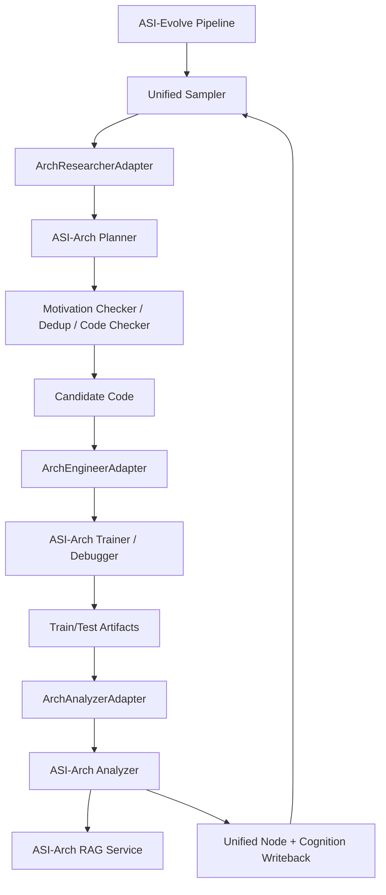
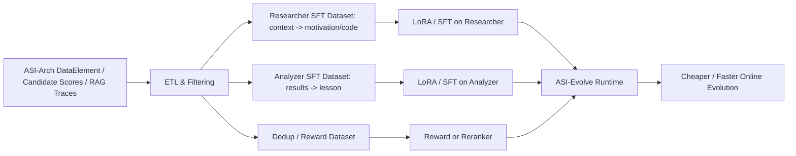

# 将两个 GitHub 项目成果融合的深度研究报告

## 执行摘要

这两个项目虽然都来自 entity["organization","GAIR-NLP","nlp research group"]，但它们解决的是两个层次不同的问题。**ASI-Arch** 是一个“强领域专用”的自治架构发现系统，目标集中在线性注意力架构创新；其公开 README 与论文摘要共同表明，它以多智能体自治科研为核心，依赖数据库与 cognition base 两个外部记忆系统，并已在线性注意力发现上进行了 1,773 次自治实验、累计超过 20,000 GPU 小时，最终发现 106 个 SOTA 架构。**ASI-Evolve** 则是一个“强框架通用”的 AI-for-AI 闭环系统，强调 Learn–Design–Experiment–Analyze 的一般化循环，既能做架构搜索，也能做数据筛选和学习算法设计；论文与 README 报告其在架构、数据、RL 算法、以及生物医药外推任务上都给出了结果，并在公开 demo 中把 circle packing 做成了可运行的最小复现实验。citeturn38view0turn35search1turn39view0turn37view0

从**源码工程形态**看，二者的互补性非常明显。ASI-Arch 的优势在于：架构研究专用 agent 角色更细，研究语境更强，外接 RAG 与候选集管理也更贴近真实“架构创新”流程；但它的公开版本更依赖外部服务、硬编码路径与占位 URL，`pipeline.py` 还是一个无限循环主进程，复现实操门槛较高。ASI-Evolve 的优势则是：模块边界更清晰，`Pipeline`/`Researcher`/`Engineer`/`Analyzer` 的接口更统一，CLI 与 YAML 配置更完整，memory 体系也能在本地通过 FAISS + sentence-transformers 直接跑起来，因而更适合作为“融合后的总控框架”。citeturn41view2turn43view0turn34view3turn38view0turn39view0turn11view5turn11view6

基于比较，我的判断是：**最可行、最短路径的融合**不是“把两个项目简单拼在一起”，而是分两阶段进行。第一阶段应采用**方案一：模块级集成**——以 ASI-Evolve 作为统一调度与状态管理框架，把 ASI-Arch 的领域专用 `evolve/eval/analyse` 能力封装成 adapter；第二阶段再做**方案二：轨迹蒸馏与迁移学习**——把 ASI-Arch 数据库里的高价值轨迹蒸馏成 ASI-Evolve 的 Researcher/Analyzer 的 SFT 或 reward 数据，以降低 token 成本并提升收敛效率。前者解决“先跑起来并统一接口”的问题，后者解决“跑得更快、更便宜、更稳”的问题。citeturn29view7turn29view8turn15view1turn15view3turn15view5turn29view10turn32view6

如果以“无特定预算、无特定团队规模”为默认假设，一个现实的落地路径是：**先在 ASI-Evolve 的 circle-packing 共享基准上做融合 A/B 实验，验证 adapter 与 memory 统一是否带来更快收敛；再把同一套 adapter 接到 ASI-Arch 的线性注意力训练栈上**。这样能先用低成本 benchmark 消除系统级不确定性，再把大 GPU 预算投入到真正昂贵的 architecture discovery 阶段。该顺序也与两个仓库公开程度的差异相匹配：ASI-Evolve 的开箱可运行性明显更好，而 ASI-Arch 更适合作为“高价值、重计算的专用后端”。citeturn18view0turn22view3turn39view0turn38view0turn35search1

## 项目对比总览

下表按你要求的九个维度，把两个项目放在同一比较框架中。

| 维度 | ASI-Arch | ASI-Evolve | 综合判断 | 依据 |
|---|---|---|---|---|
| 项目目标与贡献 | 面向线性注意力架构的自治科研系统；README 称其为端到端 architecture discovery 框架，论文摘要报告 1,773 次自治实验、20,000+ GPU 小时、106 个 SOTA 架构。 | 面向 AI-for-AI 的通用闭环系统；论文报告覆盖架构、数据、RL 算法三类 AI 栈任务，并外推到 DTI。 | ASI-Arch 更“专”，ASI-Evolve 更“泛”。 | citeturn38view0turn35search1turn37view0 |
| 模型架构 | 由 `evolve`、`eval`、`analyse`、架构数据库、RAG cognition base 组成；主循环为 sample → evolve → evaluation → analyse → update。 | 由 `Pipeline` 总控 + `Researcher`/`Engineer`/`Analyzer`/可选 `Manager` 组成，外加本地 `Database` 与 `Cognition`。 | ASI-Evolve 的组件边界更统一；ASI-Arch 的领域角色更细。 | citeturn38view0turn41view2turn11view2turn15view6 |
| 训练流程与超参 | 公开入口层主要暴露 `MAX_DEBUG_ATTEMPT=3`、`MAX_RETRY_ATTEMPTS=10` 与文件路径/服务 URL；训练本身由 `trainer`/`debugger` agent 间接触发。 | 配置显式暴露 temperature、top_p、max_tokens、seed、retry、sample_n、num_workers、judge ratio、retrieval top_k、island sampler 等。 | ASI-Evolve 的训练/搜索控制面更透明。 | citeturn43view0turn29view4turn29view5turn20view0turn20view1turn20view2turn20view3 |
| 数据集与预处理 | cognition base 使用论文 JSON 语料 + RAG 检索；analysis 阶段依据训练/测试 CSV 与 RAG 返回内容生成 DataElement。公开仓库未在主 README 中清楚给出完整 benchmark 数据预处理细则。 | 通用实验包结构清晰：`input.md`、`initial_program`、`evaluator.py`、`init_cognition.py`、`config.yaml`；DB 与 Cognition 都做 embedding + FAISS。 | ASI-Evolve 在“如何接入你自己的任务”上更完整。 | citeturn30view5turn40view7turn18view0turn21view4turn17view6turn17view9 |
| 评估指标与实验结果 | 工程面使用 train/test 结果、DataElement、以及 model judger 的 performance/innovation/complexity/weighted_final_score；论文层面报告 106 个 SOTA 架构。 | 工程面 `results.json` 中有 `score`、`eval_score`、`runtime`、`success`、`complexity`；circle-packing 还包含 `sum_radii`、`target_ratio`、`combined_score`。论文层面给出多任务增益。 | ASI-Evolve 的“统一评分接口”更强。 | citeturn29view12turn29view10turn17view4turn21view2turn21view3turn37view0 |
| 代码结构与可复现性 | 需先起 `database` 与 `cognition_base` 两套后台服务；`pipeline/config.py` 中数据库与 RAG URL 仍为占位符；主循环是 `while True`。 | CLI、配置合并顺序、demo、实验目录和评估脚本都更自描述；本地 persistence 与 FAISS 更利于单机复现。 | ASI-Evolve 明显更容易复现。 | citeturn38view0turn41view2turn43view0turn39view0turn43view7 |
| 依赖与运行环境 | Python 3.8+/推荐 conda 3.10，MongoDB 4.4+，Docker，CUDA GPU；依赖含 `flash-linear-attention`、`flash_attn`、`mamba-ssm`、`causal-conv1d` 等重型 ML 栈。 | Python 3.10+，`bash`、`python3`、OpenAI-compatible API；requirements 只有 openai、pyyaml、jinja2、numpy、faiss-cpu、sentence-transformers、可选 wandb。 | ASI-Arch 更重、更偏研究基础设施；ASI-Evolve 更轻、更偏框架骨架。 | citeturn38view0turn42view1turn39view0turn43view4turn43view5turn43view6 |
| 许可与合规性 | 仓库页标注 Apache-2.0；同时依赖外部数据库、RAG 服务与云模型接口。 | 仓库页标注 Apache-2.0；README 明确支持任意 OpenAI-compatible API endpoint。 | 代码许可兼容，真正的合规重点在外部模型、论文语料、benchmark 数据与日志留存。 | citeturn38view0turn39view0turn41view2 |
| 已知限制与假设 | 强假设在线性注意力研究域；`program_sample()` 文档说用 UCT，但当前实现实际从候选集前 10/11–50 采样；公开入口未显式给出训练超参。 | 强假设用户能提供问题描述、初始程序、evaluation script 与 domain knowledge；demo 主要围绕 circle packing。 | 两者都不是“一键全自动通用科学发现”，只是抽象层级不同。 | citeturn29view7turn34view3turn33view2turn39view0turn18view0 |

综合来看，**ASI-Arch 更像“为架构发现深度打磨过的专用科研工厂”**，而 **ASI-Evolve 更像“把闭环研究流程产品化后的通用操作系统”**。这决定了融合时不应平均用力，而应遵循“**用 ASI-Evolve 统一调度与实验生命周期；把 ASI-Arch 的高价值专用能力注入进去**”的原则。citeturn38view0turn39view0turn41view2

## 源码级技术解剖

### ASI-Arch

从代码入口看，ASI-Arch 的核心控制流非常直接：`pipeline/pipeline.py` 的 `run_single_experiment()` 明确按 **Program Sampling → Program Evolution → Program Evaluation → Result Analysis → Database Update** 五步执行；而 `main()` 又把它包进一个 `while True` 的连续实验循环里，失败后等待 60 秒重试。换句话说，ASI-Arch 的默认运行形态不是“固定 step 数的实验”，而是“长期自治科研守护进程”。这非常接近真实研究流水线，但也直接提高了复现与资源管控难度。关键函数是 `run_single_experiment()`（约 L473-L544）和 `main()`（约 L561-L611）。citeturn41view2

其**数据流核心**在 `pipeline/database/interface.py`。`program_sample()` 的文档字符串写的是“使用 UCT 算法选父节点，再取 top-2 与 random results 组成 context”；但当前实现实际调用的是 `db.candidate_sample_from_range(1, 10, 1)` 选 parent，再调用 `db.candidate_sample_from_range(11, 50, 4)` 取参考样本，随后把 parent 程序直接写回 `Config.SOURCE_FILE`。这说明：**公开实现已经从“全库 UCT”收敛为“候选集 top-50 上的分层采样”**，而文档和实现之间存在轻微偏差。对融合工程而言，这个偏差很关键，因为它决定你应该接入“候选集采样器”还是“数据库级 UCT 采样器”。关键位置在 `program_sample()`（约 L365-L415），而客户端侧也确实保留了 `uct_select_node()`、`get_top_k_results()` 和 `sample_from_range()` 三类接口。citeturn34view3turn33view2

在**演化模块**上，ASI-Arch 的 `pipeline/evolve/interface.py` 展示了它为什么更“专用”。`evolve(context)` 首先调用 `planner` 生成名字与动机；如果发现与历史动机重复，则构造 repeated context 再走 `deduplication`；同时还会调用 `motivation_checker` 用历史相似动机做重复检测，并在最后通过 `code_checker` 对生成代码进行结构正确性检查。也就是说，ASI-Arch 的 Research 逻辑不是“单一 propose()”，而是**规划、去重、动机一致性检查、代码校验**四个细粒度研究动作的组合。公共接口包括 `evolve()`（约 L541 起）、`check_repeated_motivation()`（约 L681 起）和 `check_code_correctness()`（约 L631 起）。citeturn29view0turn40view0turn40view1turn40view2turn40view3

在**评估与分析模块**上，ASI-Arch 把“跑训练”和“解释训练”显式分开。`pipeline/eval/interface.py` 中 `evaluation()` 调用 `run_training()`，后者在失败时会读取 `Config.DEBUG_FILE`，并在 `Config.MAX_DEBUG_ATTEMPT=3` 的范围内让 `debugger` agent 带着错误信息重试；训练成功后由 `save(name)` 把源码存回 code pool。`pipeline/analyse/interface.py` 则读取训练与测试 CSV，把结果聚合成 `result_dict`，再用 `Analyzer_input` 调 `analyzer`，随后以 `analysis.experimental_results_analysis` 为 query 去调用 `run_rag()`，把检索到的论文/知识再拼回 `DataElement`。这说明 ASI-Arch 把**结果解释**视为一等公民，而且把“从分析到文献检索”的桥接做在了分析器之后，而不是在生成器之前。citeturn34view1turn29view5turn34view2turn40view7turn40view8turn40view9

其**双记忆系统**也值得特别指出。数据库侧，`database/candidate_manager.py` 的 `CandidateManager` 持有 top-50 candidate set，并按 `update_threshold=50` 触发批量更新；`database/mongodb_database.py` 在新元素入库时会取最近 50 条记录让 candidate manager 重排；同时该数据库还能通过 `get_elements_with_score()` 和 `rebuild_candidates_from_scored_elements()` 重建精英集合。认知侧，`cognition_base/rag_service.py` 的 `OpenSearchRAGService` 使用 `SentenceTransformer("intfloat/e5-base-v2")` 在 CPU 上做 embedding，并把文档索引到 OpenSearch；`rag_api.py` 暴露了 `/query`、`/paper/<paper_key>`、`/stats`、`/reinit` 等 HTTP 接口。对融合而言，这意味着 ASI-Arch 的 memory 不是“轻量本地库”，而是明确的**服务化 memory plane**。citeturn34view7turn32view6turn32view5turn32view4turn31view11turn34view5turn32view0turn32view1turn34view6turn30view8

从**训练流程与超参透明度**看，ASI-Arch 公布得并不充分。`pipeline/config.py` 公开暴露了 `RESULT_FILE`、`RESULT_FILE_TEST`、`DEBUG_FILE`、`MAX_DEBUG_ATTEMPT=3`、`MAX_RETRY_ATTEMPTS=10`，以及 `RAG`、`DATABASE` 两个字符串占位 URL；但在公开 pipeline 入口中，并没有像 ASI-Evolve 那样显式给出 temperature、sampling、并行 worker、judge ratio 或领域 benchmark 的 optimizer/lr/batch size 等参数。更准确地说，**ASI-Arch 的工程控制参数是公开的，但模型训练参数在仓库主入口层是“间接存在”的**。这是该项目最大的可复现性短板之一。citeturn43view0turn43view1turn43view2turn34view1

### ASI-Evolve

ASI-Evolve 的工程哲学恰好相反：它把“闭环研究框架”的边界先定义清楚，再把具体任务塞进实验目录。`main.py` 的 `main()` 用 argparse 接收 `--config`、`--experiment`、`--steps`、`--sample-n`、`--eval-script`，创建 `Pipeline(config_path, experiment_name)`，然后调用 `pipeline.run(max_steps, eval_script, sample_n)`，最后输出统计和 best node。与 ASI-Arch 的无限主循环不同，ASI-Evolve 原生支持**固定步数、显式实验名、显式评估脚本**的运行方式。citeturn43view7turn43view8

`pipeline/main.py` 展示了它的**标准四段式控制流**。初始化时，它会用配置创建 `Database` 与 `Cognition`，并实例化 `Researcher`、`Engineer`、`Analyzer`，以及可选的 `Manager`；`run_step()` 中先从数据库采样 context nodes，再依据这些节点的 `analysis` 或 `motivation` 去 cognition store 搜索相关条目，然后把这些历史节点与 cognition items 交给 `Researcher.run()` 生成新候选，再由 `Engineer.run()` 调评估脚本，最后由 `Analyzer.run()` 把结果蒸馏成文字分析并写回 node。`_run_sequential()` 和 `_run_parallel()` 则把这个 step 循环化。核心函数包括 `run_step()`（约 L1674 起）、`_run_sequential()`（约 L2149 起）和 `_run_parallel()`（约 L2186 起）。citeturn11view0turn11view1turn11view2turn17view0turn17view1turn17view3turn11view3turn11view4

ASI-Evolve 的三个基础 agent 都做得很“接口化”。`pipeline/researcher/researcher.py` 的 `Researcher.run()` 接口签名是 `task_description, context_nodes, cognition_items, base_code`，并支持两种模式：`diff_based_evolution` 与 `full_rewrite`；如果 diff 解析失败，还会自动回退到 full generation。`pipeline/engineer/engineer.py` 的 `Engineer.run()` 接口则是 `code, experiment_dir, eval_script, timeout, task_description, judge_enabled, judge_ratio`，内部通过 `_run_script()` 执行 bash evaluator，通过 `_parse_results()` 读取 `results.json`，必要时还能把 `eval_score` 与 `judge_score` 按比例混合成最终 `score`。`pipeline/analyzer/analyzer.py` 的 `Analyzer.run()` 则接收 `code, results, task_description, best_sampled_node`，输出自然语言 `analysis`。这组接口已经非常接近“可插拔后端协议”了。citeturn15view1turn16view0turn16view1turn15view3turn16view2turn16view3turn17view4turn17view5turn15view5turn16view5

它的**memory 设计**也比 ASI-Arch 更容易嵌入式复用。`database/database.py` 的 `Database` 默认使用 `sentence-transformers/all-MiniLM-L6-v2`（384 维）和 `FAISSIndex`，能持久化 node，并支持 `sample()` 时切换采样算法；`cognition/cognition.py` 也用相同 embedding 思路存储 `CognitionItem` 并支持 `retrieve()`（检索 top-k 知识）。因此，ASI-Evolve 的数据库与知识库不是两个必须单独部署的网络服务，而是**进程内对象 + 磁盘持久化**。这对快速做 adapter 和 A/B test 非常有利。citeturn11view5turn17view6turn17view7turn16view6turn16view7turn11view6turn17view9turn16view8turn16view9

在**配置与超参**方面，ASI-Evolve 是公开得最完整的。以 `experiments/circle_packing_demo/config.yaml` 为例，API 层显式给出 `provider=sglang`、`temperature=0.6`、`top_p=0.95`、`max_tokens=65536`、`seed=42`、`top_k=20`、`timeout=600`、`retry_times=3`、`retry_delay=5`；pipeline 层给出 `diff_based_evolution=false`、`researcher/engineer/analyzer` 重试次数、`engineer_timeout=300`、`parallel.num_workers=4`、`sample_n=3`、`judge.enabled=false` 与 `judge.ratio=0.2`；cognition 层给出 `retrieval.top_k=5`、`score_threshold=0.4`；database 层给出 `max_size=70`、`sampling.algorithm=island`、`num_islands=5`、`migration_interval=10`、`migration_rate=0.1`、`exploration_ratio=0.2`、`exploitation_ratio=0.6`、`feature_dimensions=["complexity","diversity"]`、`feature_bins=10`。这意味着你几乎可以把 ASI-Evolve 当作“实验编排 DSL”来用。citeturn8view0turn8view1turn20view0turn20view1turn20view2turn20view3

其公开 demo 也很有代表性。`experiments/circle_packing_demo/` 目录包含 `input.md`、`config.yaml`、`eval.sh`、`evaluator.py`、`init_cognition.py`、`initial_program` 与 prompts；`input.md` 明确目标是 26 个圆的 circle packing，要求实现 `construct_packing()`；`initial_program` 给出一个非常朴素的 ring-based baseline；`init_cognition.py` 演示如何把人类启发式（边界效应、可变半径、hexagonal packing 等）写入 cognition store；`eval.sh` 调用 `evaluator.py` 生成 `results.json`；`evaluator.py` 则把 `sum_radii`、`target_ratio`、`combined_score`、`success`、`complexity` 等指标写回 JSON。这个 demo 既足够小可以复现，又完整覆盖了 Learn–Design–Experiment–Analyze 四段闭环。citeturn18view0turn20view8turn21view0turn22view1turn22view2turn22view0turn22view3turn21view2turn21view3

### 关键文件与函数索引

下表列出融合工作最值得直接改造或封装的代码入口。

| 项目 | 文件 | 关键函数/类 | 当前职责 | 融合价值 |
|---|---|---|---|---|
| ASI-Arch | `pipeline/pipeline.py` | `run_single_experiment()`, `main()` | 五阶段主循环与无限自治运行 | 适合作为专用后端流程模板 |
| ASI-Arch | `pipeline/evolve/interface.py` | `evolve()`, `check_repeated_motivation()`, `check_code_correctness()` | 规划、去重、代码校验 | 可包装成 Arch-domain Researcher adapter |
| ASI-Arch | `pipeline/eval/interface.py` | `evaluation()`, `run_training()` | 训练、调试、保存代码产物 | 可包装成 Arch-domain Engineer adapter |
| ASI-Arch | `pipeline/analyse/interface.py` | `analyse()` | 汇总 train/test、调用 analyzer 与 RAG | 可包装成 Arch-domain Analyzer adapter |
| ASI-Arch | `pipeline/database/interface.py` | `program_sample()`, `update()` | 从候选集采样并写回数据库 | 需改造成可插拔采样器 |
| ASI-Arch | `database/candidate_manager.py` | `CandidateManager` | 精英 top-50 维护 | 可为 ASI-Evolve 提供 elite memory |
| ASI-Arch | `cognition_base/rag_service.py` | `OpenSearchRAGService`, `search_similar_patterns()` | 论文级 RAG 服务 | 可作为高质量外部 cognition backend |
| ASI-Evolve | `main.py` | `main()` | CLI 入口 | 最适合加入 `--backend/--adapter` 之类融合开关 |
| ASI-Evolve | `pipeline/main.py` | `Pipeline`, `run_step()`, `_run_sequential()`, `_run_parallel()` | 通用实验生命周期编排 | 最适合作为融合后的总控层 |
| ASI-Evolve | `pipeline/researcher/researcher.py` | `Researcher.run()` | 生成候选代码 | 可被 ASI-Arch 专用 planner 替换或增强 |
| ASI-Evolve | `pipeline/engineer/engineer.py` | `Engineer.run()` | 跑 evaluator、解析结果、计算 score | 可接入 ASI-Arch 训练后端 |
| ASI-Evolve | `pipeline/analyzer/analyzer.py` | `Analyzer.run()` | 结果解释与 lesson 提炼 | 可与 ASI-Arch 分析器做级联或蒸馏 |

表中索引综合自仓库 README 与具体源码入口。citeturn41view2turn29view0turn40view2turn40view3turn34view1turn34view2turn34view3turn34view7turn34view5turn32view0turn43view7turn17view0turn15view1turn15view3turn15view5

## 评估结果、复现性与合规性

如果只看**论文层结果**，ASI-Evolve 的“证明面”更大：它在 architecture design、pretraining data curation、RL algorithm design 三条 AI 主线都给了正结果，且分别报告了 +0.97、平均 +3.96、以及多项数学 benchmark 上 +12.5 / +11.67 / +5.04 的增益；此外，在 circle packing 的共享 benchmark 上，它用 17 轮达到 2.63597、最好 2.635983，并在消融中证明 Analyzer 与 Cognition 对搜索初期和中后期都显著有利。ASI-Arch 的论文层结果则更垂直、更深入：它把全部算力都压在线性注意力发现上，从而形成了 106 个架构与 20,000+ GPU 小时的研究规模。前者更证明“框架普适性”，后者更证明“专业任务深度”。citeturn37view0turn35search1

如果只看**开源仓库可复现性**，结论则刚好相反。ASI-Evolve 的 README 已经给出实验目录模板、配置合并顺序、circle-packing demo 的初始化命令和运行命令；其 `requirements.txt` 也非常短，说明它把“难点”更多放在用户的 evaluator 与 domain knowledge 里，而不是隐藏在框架内部。ASI-Arch 则需要先后启动 `database/` 和 `cognition_base/` 的后台服务，安装主 requirements、database requirements 与 cognition requirements，并在 `pipeline/config.py` 中处理数据库/RAG URL 与文件路径；这意味着它更像“研究实验室内部基座”，而不是轻量可移植框架。citeturn39view0turn18view0turn43view4turn38view0turn43view0

更值得注意的是，ASI-Arch 在**工程接口一致性**上存在一个值得修复的点：`program_sample()` 的说明强调 UCT，而实现却从 candidate set 的固定名次区间采样；与此同时，客户端 API 又保留了 `uct_select_node()`。这说明仓库已经经历过一次从“全局树搜索”到“精英池采样”的策略收敛，但接口层尚未完全统一。这并不是坏事，反而是很好的融合切入点：你完全可以把这个地方改成 ASI-Evolve 风格的 `sampling.algorithm` 插件式配置。citeturn29view7turn34view3turn33view2

在**许可与合规**方面，两个项目的代码层都相对友好：仓库页都标注了 Apache-2.0。真正需要注意的，不是代码许可是否兼容，而是三类外部资产。其一是**模型接口**：ASI-Arch 代码默认实例化的是 Azure 风格异步 OpenAI 客户端，而 ASI-Evolve README 则写明是 “any OpenAI-compatible API endpoint”；其二是**知识资产**：ASI-Arch 的 cognition base 建立在大量论文 JSON 之上，ASI-Evolve 也鼓励用户注入 papers / heuristics / domain knowledge；其三是**实验日志**：两个系统都会把动机、代码、结果、分析写入数据库或磁盘。实际落地时，组织应把 API key 管理、论文/benchmark license 审查、以及日志脱敏纳入发布流程，而不是只看仓库许可证。citeturn41view2turn39view0turn38view0turn34view5

## 融合方案设计

我建议优先做两种方案：**方案一解决“统一运行时”**，**方案二解决“统一经验模型”**。二者并不冲突，最优路径通常是先做方案一，再把方案二叠加到方案一之上。

### 方案一：模块级集成

这个方案的原则是：**保留 ASI-Evolve 作为统一调度器、配置中心与状态容器；把 ASI-Arch 的领域专用研究后端适配为可插拔 adapter。** 这样做的理由是，ASI-Evolve 的 `Pipeline` 生命周期、CLI 与本地数据库更接近一个“框架骨架”，而 ASI-Arch 的 `evolve/eval/analyse` 更像“已经为架构研究打磨好的专家执行器”。citeturn43view7turn17view0turn29view0turn34view1turn34view2



在接口层，建议把 ASI-Arch 包装成三类 adapter，而不是直接把文件夹“拷进去”：

```python
from dataclasses import dataclass
from pathlib import Path
from typing import Any, Protocol

@dataclass
class FusionTask:
    task_description: str
    parent_code: str | None
    step_dir: Path
    context_nodes: list[dict[str, Any]]
    cognition_items: list[dict[str, Any]]
    eval_script: str | None = None

@dataclass
class CandidateProgram:
    name: str
    motivation: str
    code: str
    metadata: dict[str, Any]

@dataclass
class EvalResult:
    success: bool
    score: float
    metrics: dict[str, Any]
    runtime: float

@dataclass
class AnalysisResult:
    analysis: str
    lessons: list[str]
    references: list[str]

class ResearchBackend(Protocol):
    async def propose(self, task: FusionTask) -> CandidateProgram: ...

class EvalBackend(Protocol):
    async def evaluate(self, candidate: CandidateProgram, task: FusionTask) -> EvalResult: ...

class AnalyzeBackend(Protocol):
    async def analyze(
        self, candidate: CandidateProgram, result: EvalResult, task: FusionTask
    ) -> AnalysisResult: ...
```

训练/推理流程建议分成两层。**在线推理层**的单步流程是：ASI-Evolve 采样历史 node 与 cognition → `ArchResearcherAdapter` 把这些上下文压成 ASI-Arch `evolve(context)` 所需要的字符串上下文 → ASI-Arch 生成新动机与代码并完成去重/代码校验 → `ArchEngineerAdapter` 调用 ASI-Arch `evaluation()` 或者其底层 trainer/debugger → 解析 train/test/benchmark 结果 → `ArchAnalyzerAdapter` 调用 ASI-Arch `analyse()` 和 RAG → 把分析摘要写回 ASI-Evolve 的 `Database`/`Cognition`。**离线训练层**则只需要做 schema 对齐：把 ASI-Arch 的 `DataElement` 映射成 ASI-Evolve 的 `Node`/`CognitionItem`。这类映射完全可行，因为 ASI-Arch 的 `DataElement` 已包含 `result/program/motivation/analysis/cognition/log/parent/summary` 等字段。citeturn29view10turn34view3turn40view7turn15view1turn15view3turn15view5

**所需数据与计算资源**可分为两档。第一档是共享低成本验证：直接使用 ASI-Evolve 自带 circle-packing 任务，主要成本来自 LLM 推理和 evaluator，GPU 需求可以为零或单卡；第二档是架构发现真任务：按 ASI-Arch 论文给出的 20,000+ GPU 小时规模，若只做“小规模可行性验证”，建议先控制在 2,000–5,000 GPU 小时；若追求论文级发现深度，则需要接近其数量级。换言之，这个方案非常适合先用小 benchmark 验证系统，再逐步放大到昂贵训练。citeturn18view0turn22view3turn35search1

这个方案的优点很突出。第一，它最大化保留 ASI-Arch 的领域知识密度和去重逻辑；第二，它复用 ASI-Evolve 更清晰的配置、采样、统计与 persistence 体系；第三，它最容易做可控 A/B，因为只需替换 Research/Eval/Analyze backend，而无需重写全部 memory 层。缺点同样明确：一是 ASI-Arch 现在仍偏文件驱动和服务驱动，需要 adapter 去清理副作用；二是两个项目的 memory 语义不同，容易出现“双写冲突”；三是架构训练任务非常重，如果先在高成本 benchmark 上验证，集成成本会被 GPU 成本放大。citeturn41view2turn34view3turn34view5turn11view5turn11view6

主要风险与缓解措施如下。**风险一**是接口不纯：ASI-Arch `evaluation()`/`analyse()` 依赖 `Config.*` 文件路径。缓解办法是先做“纯函数化重构”，把路径和 URL 全部参数化。**风险二**是采样语义冲突：ASI-Arch 倾向 candidate set，ASI-Evolve 倾向 sampler policy。缓解办法是让 ASI-Evolve 成为唯一采样源，ASI-Arch 只负责 propose/evaluate/analyze。**风险三**是结果 schema 漂移：train/test CSV、`results.json`、`DataElement.result` 三种产物格式不同。缓解办法是统一成 `EvalResult(metrics: dict)`。**风险四**是成本失控。缓解办法是先用 circle packing 和一个迷你 architecture benchmark 验证。citeturn43view0turn34view3turn21view3turn29view10

预期评估指标建议分两个层面。**系统层指标**：候选代码通过率、单步平均时延、失败重试率、唯一 motivation 比率、memory 写回成功率。**研究层指标**：circle packing 的 `sum_radii`/`combined_score` 与“达到阈值所需轮数”；架构任务则看 top-1/top-k 最佳分数、超过基线/超过 DeltaNet 的候选数、以及单位 GPU 小时收益。消融实验建议至少做五组：去掉 ASI-Arch dedup；去掉 RAG；把 ASI-Evolve 采样从 island 切到 random/UCB1；禁用 Analyzer；把 Researcher 从 diff-based 改成 full-rewrite。这样才能分离“框架贡献”和“领域后端贡献”。citeturn20view1turn22view3turn37view0turn15view1

### 方案二：轨迹蒸馏与迁移学习

第二个方案不以“统一运行时”为中心，而以“统一经验模型”为中心：**把 ASI-Arch 长期实验轨迹蒸馏成 ASI-Evolve 的 Researcher/Analyzer 的监督数据、对比数据或 reward 数据**。这尤其适合在第一阶段集成跑通之后，用来进一步减少 LLM 成本并提高搜索效率。因为 ASI-Arch 的数据库已经积累了「动机 → 程序 → 结果 → 分析 → 候选分数」这一整条链条，而这正是训练 agent policy 的理想监督信号。citeturn29view10turn32view5turn32view6turn30view11



接口上，建议先定义统一的轨迹 schema，而不是一开始就做模型训练：

```python
@dataclass
class TrajectoryRecord:
    context: str
    parent_id: int | None
    motivation: str
    code: str
    result_summary: str
    analysis: str
    cognition: str
    score: float | None
    success: bool | None

def build_record_from_dataelement(elem: dict) -> TrajectoryRecord:
    ...
```

然后把数据拆成三类训练集。第一类是 **Researcher-SFT**：输入 `context + cognition + parent summary`，输出 `motivation + code diff/full code`。第二类是 **Analyzer-SFT**：输入 `result_summary + best_sampled_node + task description`，输出 `analysis`。第三类是 **dedup/reward 数据**：使用 candidate score、是否被纳入 top-50、以及历史重复动机标签，训练一个轻量 reranker 或 repetition classifier，用于在线干预候选排序。这个拆分与两个仓库的现有字段定义是自然对应的。citeturn29view10turn29view12turn15view1turn15view5

训练流程建议采取“先轻后重”的路线。先做 **LoRA/SFT**，而不是一上来做 RL。原因是公开仓库已经拥有高质量的 demonstration：ASI-Arch 的好轨迹本质上就是序列化的 expert demonstrations。具体做法可以是：先过滤掉训练失败、分析为空、score 太低的轨迹，再按 `score` 或 candidate set 状态做分层采样；Researcher 侧做 causal LM SFT，Analyzer 侧做 instruction SFT；在线部署时先只替换 ASI-Evolve 的 `Researcher`/`Analyzer` 文本后端，不动 `Engineer`。如果在线 A/B 显示“通过率更高、达到阈值的轮数更少、平均 token 使用更低”，再考虑用 reward model 或 DPO 做第二轮提升。citeturn32view5turn32view6turn30view11turn17view4

资源上，这个方案比方案一明显便宜得多。ETL 主要是 CPU 与磁盘 IO，几乎没有大资源压力；LoRA/SFT 如果以 7B–14B 级模型为目标，通常 2–4 张 80GB 级 GPU 就足以完成第一版；真正的成本在于**清洗轨迹和定义高价值子集**，而不是训练本身。这里要特别强调：这是一种工程估算，不是仓库官方数字；其依据只是 ASI-Arch 公开数据结构的丰富程度与 ASI-Evolve 已经非常轻量的在线依赖。citeturn29view10turn39view0turn43view4

方案二的优点是：第一，能把 ASI-Arch 的长期研究经验“压缩”成更便宜、更快的在线 inference policy；第二，不需要在第一步就统一两个 memory 系统；第三，能直接改善 ASI-Evolve 在高成本任务上的 sample efficiency。其缺点是：第一，它并不能替代方案一的运行时整合；第二，轨迹质量不齐，失败样本和 debug 过程很多，清洗成本高；第三，如果训练数据几乎全来自线性注意力任务，Researcher 很可能过拟合到该域。citeturn29view5turn29view10turn32view6

风险与缓解措施方面，**风险一**是 demonstration leakage：低质量或失败中间态会污染 policy。缓解是按 `success`、candidate score、是否进入 top-50 过滤，并加入 hard negatives。**风险二**是域过拟合：Researcher 学会了“像线性注意力专家一样说话”，却失去跨域 generality。缓解是使用多域 mixture：至少把 ASI-Evolve 的 circle packing 轨迹和少量其他任务一起混入。**风险三**是分析器产生虚假高质量解释。缓解是把 `analysis` 与最终 score、后续被检索使用频次共同作为权重，而不是把所有 analyzer 文本视为同质量 gold。citeturn18view0turn37view0turn29view10turn32view5

评估指标建议分成**离线**和**在线**两组。离线指标包括：Researcher 生成代码的静态可通过率、重复动机识别 AUC、Analyzer 输出与高分轨迹分析的一致性、token 成本下降比例。在线指标包括：候选有效率、达到给定 score 阈值所需步数、单位成本最优值、最终 top-k 成绩。核心消融是四组：只蒸馏 Researcher；只蒸馏 Analyzer；Researcher+Analyzer 联合蒸馏；再加 reward/reranker。还应再做一组“是否使用 candidate score 过滤”的数据质量消融。citeturn29view12turn17view4turn15view5

## 实施路线、资源与复现脚本

### 推荐实施顺序与时间估算

在“无特定约束”的前提下，我建议采用下面这个 **8 周路线图**。它的核心思想是：**第一个月先解决系统集成，第二个月再做经验蒸馏与成本优化**。

| 周次 | 目标 | 主要输出 |
|---|---|---|
| 第 1 周 | 冻结两个仓库版本，建立 monorepo 或子模块结构 | 可重复构建脚本、版本锁定文档 |
| 第 2 周 | 抽象统一数据结构与 adapter 协议 | `FusionTask/CandidateProgram/EvalResult/AnalysisResult` |
| 第 3 周 | 把 ASI-Arch 的 `evolve/eval/analyse` 解耦成可参数化后端 | `arch_adapter.py`、文件路径参数化 |
| 第 4 周 | 在 circle-packing 上跑通方案一 | 首个融合闭环、日志与对比曲线 |
| 第 5 周 | 整理 ASI-Arch 轨迹 ETL，构造蒸馏数据集 | `trajectory_export.py`、过滤规则 |
| 第 6 周 | 做 Researcher/Analyzer 的 LoRA/SFT 原型 | 第一版蒸馏权重或 adapter prompt |
| 第 7 周 | 做在线 A/B 与完整消融 | 收敛速度、通过率、成本表 |
| 第 8 周 | 整理复现实验、配置模板、合规模板 | 报告、脚本、配置、审计清单 |

这个排期的依据是：ASI-Evolve 的 demo 和 config 已足够支持低成本原型验证，而 ASI-Arch 的大头成本主要在后端训练栈与 memory 服务，因此不应一开始就把全部时间烧在 full-scale architecture search 上。citeturn18view0turn39view0turn38view0turn35search1

### 人员与硬件资源清单

建议团队最少 3 人，理想 4 人。一个现实的配置是：1 名研究负责人/架构师，1 名 LLM/agent 工程师，1 名训练与系统工程师，外加 0.5–1 名 DevOps/MLOps 支持。前两者负责 adapter、trajectory、分析器与 prompt/模型；第三人负责训练栈、评估脚本、GPU 调度与 benchmark 稳定性。这个角色拆分，本质上对应了两个仓库已经显式分出的研究、评估、分析与 memory 职责。citeturn38view0turn39view0turn41view2

硬件建议分层配置。**POC 层**：1 台 24GB–48GB 显存工作站 + 32 CPU + 64GB RAM，就足以完成 circle-packing 与 adapter 联调。**集成验证层**：2–4 张 80GB 级 GPU、64–128 CPU、256GB RAM、2TB NVMe，用于蒸馏和中等规模 benchmark。**论文级架构发现层**：多机多卡，至少 8 张以上高端 GPU，预算按 2,000–5,000 GPU 小时的“小规模验证”或 20,000+ GPU 小时的“接近 ASI-Arch 论文规模”两档准备。后一档并不是必须，但它给出了上限参照。citeturn35search1turn38view0

### 关键代码修改点

| 修改点 | 建议动作 | 目的 |
|---|---|---|
| `ASI-Evolve/main.py` | 增加 `--backend`, `--adapter`, `--arch-root` 等参数 | 让融合原型可以从 CLI 选择后端 |
| `ASI-Evolve/pipeline/main.py` | 为 `Researcher/Engineer/Analyzer` 增加 backend registry | 用统一 pipeline 驱动不同研究后端 |
| `ASI-Arch/pipeline/evolve/interface.py` | 去掉对全局 `Config.SOURCE_FILE` 的隐式依赖，返回结构化 `CandidateProgram` | 便于被外部 pipeline 调用 |
| `ASI-Arch/pipeline/eval/interface.py` | 把 train/debug/save 过程参数化，并统一返回 `EvalResult` | 便于跟 `Engineer.run()` 对接 |
| `ASI-Arch/pipeline/analyse/interface.py` | 把 CSV 读取、RAG 调用、DataElement 封装拆成纯函数 | 便于复用与单元测试 |
| `ASI-Arch/pipeline/database/interface.py` | 让采样策略显式配置化，并修正文档/实现偏差 | 便于统一 ASI-Evolve sampler |
| `ASI-Arch/pipeline/config.py` | 把 URL、路径、重试参数迁移到 YAML/env | 降低部署耦合与复现成本 |
| `ASI-Arch/database/candidate_manager.py` | 导出候选分数与更新时间戳到 ETL | 支持方案二的 reward/蒸馏数据 |

上表中的每个点都直接对应公开源码中可见的耦合点：例如 ASI-Arch 的全局 `Config.*` 路径、候选集 top-50 逻辑、以及 ASI-Evolve 已经存在的统一 CLI/pipeline 入口。citeturn43view7turn17view0turn29view0turn34view1turn34view2turn34view3turn43view0turn34view7

### 关键伪代码示例

下面这段伪代码对应**方案一的最小 adapter 原型**。它的价值在于：只要这段逻辑能在 circle-packing 上跑通，后续再替换成 ASI-Arch 的线性注意力后端就是工程放大，而不是方向性不确定。

```python
# fusion/backends/asi_arch_adapter.py
from pathlib import Path

class ASIArchResearchBackend:
    async def propose(self, task: FusionTask) -> CandidateProgram:
        context = self._build_arch_context(task.context_nodes, task.cognition_items)
        name, motivation = await arch_evolve(context)   # ASI-Arch evolve()
        code = Path(self.source_file).read_text(encoding="utf-8")
        return CandidateProgram(
            name=name,
            motivation=motivation,
            code=code,
            metadata={"backend": "asi_arch"}
        )

class ASIArchEvalBackend:
    async def evaluate(self, candidate: CandidateProgram, task: FusionTask) -> EvalResult:
        Path(self.source_file).write_text(candidate.code, encoding="utf-8")
        ok = await arch_eval(candidate.name, candidate.motivation)  # ASI-Arch evaluation()
        metrics = self._collect_metrics(self.train_csv, self.test_csv)
        score = self._reduce_metrics(metrics)
        return EvalResult(success=ok, score=score, metrics=metrics, runtime=metrics.get("runtime", 0))

class ASIArchAnalyzeBackend:
    async def analyze(self, candidate: CandidateProgram, result: EvalResult, task: FusionTask) -> AnalysisResult:
        elem = await arch_analyse(candidate.name, candidate.motivation, parent=task.context_nodes[0]["id"])
        return AnalysisResult(
            analysis=elem.analysis,
            lessons=[elem.summary] if getattr(elem, "summary", None) else [],
            references=[elem.cognition] if getattr(elem, "cognition", None) else [],
        )
```

而这段伪代码对应**方案二的 trajectory ETL**。关键不是模型训练本身，而是先把数据“变干净”。

```python
# fusion/data/export_arch_trajectories.py
def export_records(db_client) -> list[TrajectoryRecord]:
    records = []
    for elem in db_client.get_elements_with_score():
        if elem.result is None:
            continue
        score = elem.result.get("score") if isinstance(elem.result, dict) else None
        if score is None:
            continue
        records.append(
            TrajectoryRecord(
                context=build_context_from_parent_and_refs(elem.parent),
                parent_id=elem.parent,
                motivation=elem.motivation,
                code=elem.program,
                result_summary=summarize_result(elem.result),
                analysis=elem.analysis or "",
                cognition=elem.cognition or "",
                score=score,
                success=score > 0
            )
        )
    return records

def build_sft_pairs(records):
    researcher_pairs, analyzer_pairs = [], []
    for r in records:
        if r.success and len(r.code) > 0:
            researcher_pairs.append({
                "input": r.context,
                "output": {"motivation": r.motivation, "code": r.code}
            })
        if r.analysis.strip():
            analyzer_pairs.append({
                "input": r.result_summary,
                "output": {"analysis": r.analysis}
            })
    return researcher_pairs, analyzer_pairs
```

这些示例都不是仓库现成代码，而是基于当前公开接口设计的**最小可行融合骨架**。它们成立的前提，是 ASI-Arch 已公开 `evolve/evaluation/analyse/program_sample/DataElement` 等职责边界，ASI-Evolve 已公开 `Pipeline/Researcher/Engineer/Analyzer` 的稳定调用面。citeturn29view0turn34view1turn34view2turn29view10turn17view0turn15view1turn15view3turn15view5

### 可复现命令与配置示例

下面第一组命令是两个原仓库公开给出的最小运行方式；第二组则是本文建议的融合原型命令。前者可以直接作为基线，后者则用于验证 adapter 是否工作。citeturn38view0turn39view0turn18view0turn43view7

```bash
# ASI-Arch：启动依赖服务并运行主循环
conda create -n asi-arch python=3.10
conda activate asi-arch
pip install -r requirements.txt
pip install -r database/requirements.txt
pip install -r cognition_base/requirements.txt

cd database
docker-compose up -d
./start_api.sh

cd ../cognition_base
docker-compose up -d
python rag_api.py

cd ../pipeline
python pipeline.py
```

```bash
# ASI-Evolve：官方 circle-packing demo
pip install -r requirements.txt
python experiments/circle_packing_demo/init_cognition.py
python main.py \
  --experiment circle_packing_demo \
  --steps 10 \
  --sample-n 3 \
  --eval-script /absolute/path/to/experiments/circle_packing_demo/eval.sh
```

```bash
# 融合原型：建议命令
python main.py \
  --config configs/fusion_arch_adapter.yaml \
  --experiment arch_fusion_poc \
  --steps 20 \
  --sample-n 3 \
  --eval-script /absolute/path/to/experiments/circle_packing_demo/eval.sh
```

一个可行的融合配置起点如下。它不是仓库原生文件，而是建议你新增的配置模板。

```yaml
# configs/fusion_arch_adapter.yaml
experiment_name: "arch_fusion_poc"

api:
  provider: "openai_compatible"
  model: "Qwen3-32B"
  temperature: 0.3
  top_p: 0.95
  max_tokens: 16384
  seed: 42
  timeout: 600

adapter:
  backend: "asi_arch"
  arch_root: "/workspace/ASI-Arch"
  source_file: "/workspace/ASI-Arch/pipeline/files/modification/model.py"
  train_csv: "/workspace/ASI-Arch/pipeline/files/analysis/loss.csv"
  test_csv: "/workspace/ASI-Arch/pipeline/files/analysis/benchmark.csv"
  rag_url: "http://127.0.0.1:5000"
  database_url: "http://127.0.0.1:8000"

pipeline:
  agents:
    manager: false
    researcher: true
    engineer: true
    analyzer: true
  researcher:
    diff_based_evolution: true
    max_code_length: 50000
  max_retries:
    researcher: 3
    engineer: 2
    analyzer: 2
  parallel:
    num_workers: 2
  sample_n: 3
  engineer_timeout: 1800

cognition:
  retrieval:
    top_k: 5
    score_threshold: 0.4

database:
  sampling:
    algorithm: "island"
  max_size: 70
```

最后，建议你把复现实验分成两个层次来提交结果。**基线层**报告 ASI-Arch 原生、ASI-Evolve 原生、融合方案一、融合方案二在共享低成本任务上的收敛曲线与成本。**扩展层**再报告线性注意力真实任务上的 top-k gain、SOTA hit count、GPU-hour efficiency。只要按这个结构组织结果，融合工作的学术价值、工程价值与复现价值都会比较清楚。citeturn37view0turn35search1